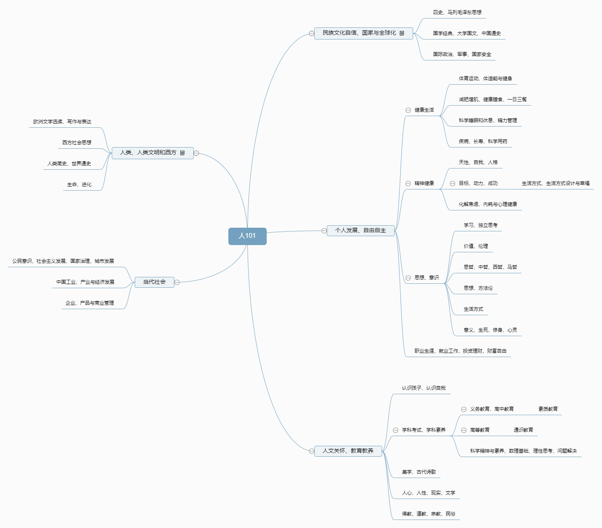

# TO BE A BETTER MAN

:alien:作为人类生活在这个地球上，我们需要很多指导。 
这是一份作为普通人类的知识框架，上帝会不会也用这个构建出不同的人。

作为人类，我们的认识领域还会有怎样的扩展边界。

# 丰富生活、理解自我
* [:kiss: 活着、幸福、成长、职业生涯与人生观](living.md) 
* [:baby: 情绪、自我](grow.md) 

# 养育、教育与素养
* [:baby: 小学、中学、大学](edu.md) 
* [:baby: 儿童、亲子](child.md) 
* [:thinking: 思考、学习、理性决策](think.md)  
* [:rocket: 科学、哲学、真理](science.md)  

# 卫生与健康
* [:leafy_green: 贫困、疾病、可持续发展](disease.md)
* [:revolving_hearts: 睡眠、膳食营养与健康](health.md)  
* [:weight_lifting_man: 科学健身与人体](run.md)  

# 认识社会
* [:man_cook: 个人命运、国家、政治与社会](society.md)  
* [:moneybag: 个人财富、经济与社会](wealth.md)  
* [:man_cook: 民族文化、历史](history.md)  

# 技术工具
* [:speak_no_evil: 外语与表达](english.md) 
* [:speak_no_evil: 计算机科学与技术](https://github.com/codefossil/javabook)
