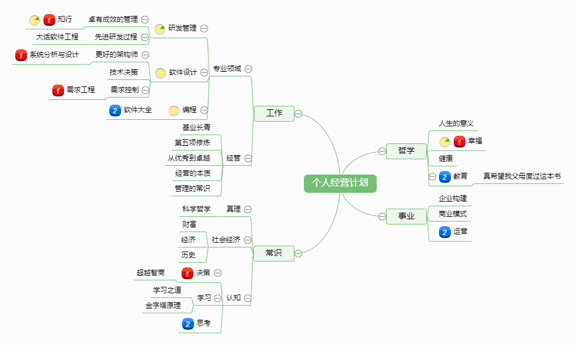

# TO BE A BETTER MAN

:alien:作为人类生活在这个地球上，我们需要很多指导。 
这是一份作为普通人类的知识框架，上帝会不会也用这个构建出不同的人。

作为人类，我们的认识领域还会有怎样的扩展边界。

# 个人生活
* [:kiss: 活着、幸福与人生观](living.md) 
* [:weight_lifting_man: 营养、健身与人体](run.md)  
* [:moneybag: 财富、经济与社会](wealth.md)

# 成长
* [:baby: 提升、教育与自我](grow.md) 
* [:thinking: 思考训练、决策与心智](think.md)
* [:speak_no_evil: 外语与表达](english.md) 

# 连接
* [:rocket: 科学、历史与真理](science.md)  
* [:man_cook: 经济、政治与社会](society.md)  

**书籍收集**

世界上最有影响力的人推荐的书籍  
https://www.mostrecommendedbooks.com/

如果码农是职业，下面的链接也适合你
> [事业 作为IT工作者的知识框架](https://github.com/codefossil/javabook)