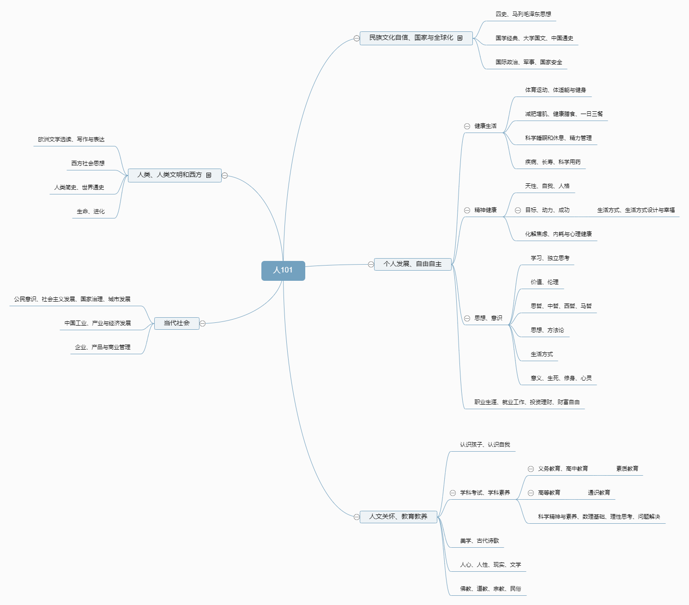

# TO BE A BETTER MAN

:alien:作为人类生活在这个地球上，我们需要很多指导。 
这是一份作为普通人类的知识框架，上帝会不会也用这个构建出不同的人。

作为人类，我们的认识领域还会有怎样的扩展边界。

# 人类文明与发展
* [:rocket: 生命进化与人类](life.md)  
* [:thinking: 思考、学习、理性决策](think.md)  
* [:rocket: 哲学、科学、真理](science.md) 

# 全球发展、社会、国家治理
* [:man_cook: 全球史观、地缘、国家安全](global.md)  
* [:moneybag: 中国发展、产业、城市与经济](wealth.md) 
* [:man_cook: 国家认同、地方志与历史](history.md) 
* [:earth_asia: 可持续发展、贫困、疾病](disease.md)
* [:man_cook: 权力与政治、法律](political.md)  

# 精神与身体健康
* [:kiss: 活着、成长、幸福](living.md) 
* [:baby: 情绪、自我](grow.md) 
* [:leafy_green: 睡眠、膳食营养与健康](health.md)  
* [:weight_lifting_man: 科学健身与人体](run.md)  

# 儿童养育
* [:books: 升学、教育](edu.md) 
* [:baby: 儿童、亲子](child.md)

# 工作与职业
* [:kiss: 个人财富、职业生涯](living.md) 
* [:speak_no_evil: 外语与表达](english.md) 
* [:computer: 计算机科学与技术](https://github.com/codefossil/javabook)
* [:office: 企业、产品与管理](https://github.com/codefossil/productbook) 