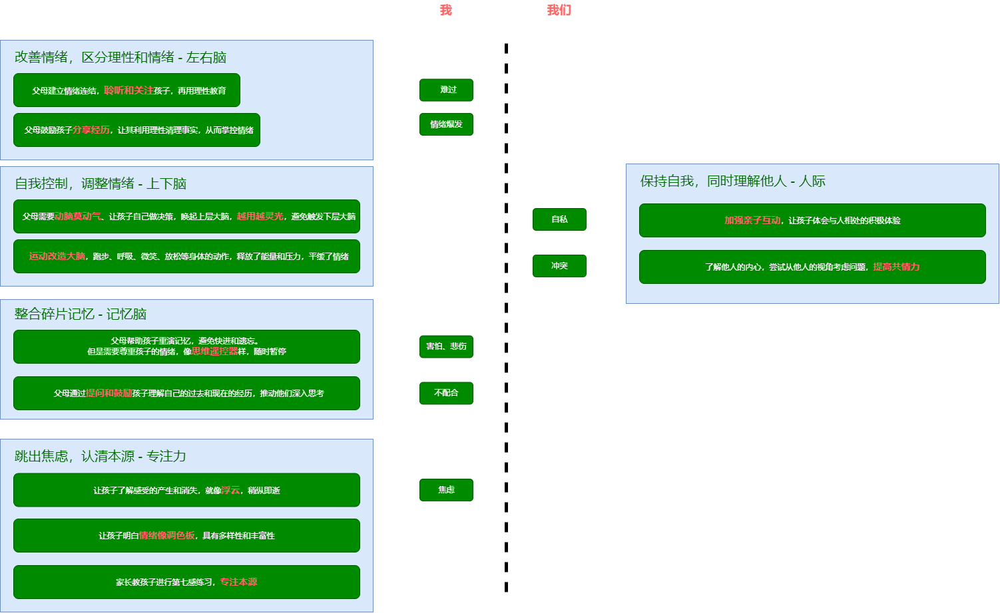

# 教养、亲子关系

[全脑教养法，siegel2012](https://book.douban.com/subject/22224887/)

感受是暂时的，平均来说，一种情绪从产生到消逝的时间不会超过90秒。  
我们的身体感觉塑造了我们的情绪，我们的情绪塑造了我们的思想和头脑中的图像；反之亦然。  
即使是那些天生对联结和同情不敏感的孩子，也能够在人际关系中感受联结的意义，并且学会承担责任。  
不断有研究表明，如果父母能够持续、稳定地了解和敏锐地回应孩子的情绪和需要，那么无论是在社交、情绪、身体还是学术上，孩子的生活都将更加繁盛。  
在帮助孩子在与人交往的过程中变得更加接纳之时，我们要时刻谨记保持他们的独立个性的重要性。  

[孩子：挑战](https://book.douban.com/subject/35200665/)  

人们逐渐明白了：人生而平等。每个人都有为自己做决定的权利。  
我们只能在遵守规则的前提下拥有自由，这个规则不是独裁者或者权威机构为自身利益而设，而是为了维护社会整体利益，每个个体都应当遵循。  
我们不能再强迫孩子绝对顺从，而应该用激发和鼓励的方式，让孩子主动遵循应有的规则。 

[让孩子性格好、身体好、学习好]()

[真希望我父母读过这本书]()

[伯克毕生发展心理学, berk2014](https://book.douban.com/subject/25773343/)  
更好的看待和养育孩子。  
结合论文，详细介绍了人的一生每个重要阶段生理和心理的发展情况。  
儿童从出生到青年，身体发育、自我理解、语言发展、情绪管理。  
家庭教养方式、社会大环境的影响。

[准备]()  
看似讲Submit高中的运作逻辑-何为一所好的学校，另一方面激发我们家长分析自己的问题。
核心是**人生设计**，通过习得通用的生活技能和学术知识，每个孩子都会过上满足的人生。  
为了找到自己想要什么，我们是否可以**列出目录**，穷举所有可能的人类活动（所有的职业、其他人分享的成就）  

[Diane Tavenner共享的教养工具箱](https://preparedparents.org/resources/)

[The Challenge](https://book.douban.com/subject/26304087/)
