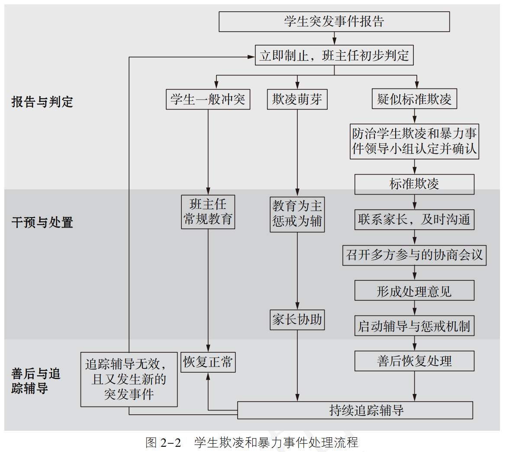
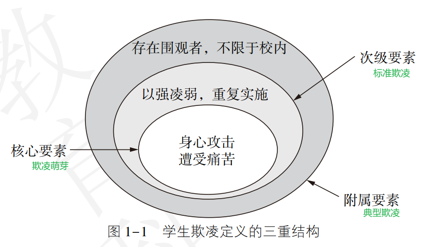

[华东师范大学发展规划部](https://fzghb.ecnu.edu.cn/szgjdt/list.htm)

# 教育
> “为谁培养人、培养什么人、怎样培养人”始终是教育的根本问题

教化与教育

> 教育前沿跟踪、教育发展主要指标及其趋势比较研究
> 全球化背景下中国特色基础教育发展

[2022年全国教育事业发展基本情况](http://www.moe.gov.cn/fbh/live/2023/55167/sfcl/202303/t20230323_1052203.html)

[教育部等六部门关于实施基础学科拔尖学生培养计划2.0的意见](http://www.moe.gov.cn/srcsite/A08/s7056/201810/t20181017_351895.html)  
应对人类未来重大挑战，引导学生关注气候变化、能源危机、人类健康、地缘冲突、全球治理、可持续发展等重大挑战，树立破解人类发展难题的远大志向，孕育产生新思想、新理论。探索重大科学问题，鼓励学生在物质结构、宇宙演化、生命起源、意识本质等基础科学领域深入探索、坚定志趣，**为推动实现重大科学突破、形成自然科学“中国力量”和哲学社会科学“中国学派”奠定基础。**  

**处理好“专”与“博”的关系，努力为学生建构“底宽顶尖”的金字塔型知识结构**。

[国家高等教育智慧教育平台](https://www.chinaooc.com.cn/)

[推动在线教育转型升级](https://iwaes.gmw.cn/show/detail.jsp?newsID=%2BPzoCcfQMLs%3D)

[中国教育三十人论坛](https://www.master-insight.com/author/zhongguojiaoyusanshirenluntan/)

[面向未来的教育：培养21世纪核心素养的全球经验](https://www.wise-qatar.org/app/uploads/2019/04/wise_research21st_century_skills_chinese.pdf)

# 通识教育

> 围绕“认识、理解、塑造自我”的核心，在 “过去、现在与未来”和“个人、国家、文明与世界”两个维度扩展，培养学生面向未来、面向全球，具有深度思考与批判创新的能力。

[北京大学通识核心课程建设办法](http://www.dean.pku.edu.cn/web/rules_info.php?id=49)

[通识教育在成长中为何重要？](https://www.gotopku.cn/index/detail/506.html)

[新文科视野下的大学通识教育](https://www.journal.sdu.edu.cn/__local/E/16/2B/C9388224DBC26CACB3B2C1A7A5F_FE75BA3C_111D61.pdf)  
学生主体性是人类主体性重要的组成部分,不仅强调学生主体获取知识和技能的能力,还要重视学生的主体情感、道德价值等主观能动性,重视因科技快速发展而忽略对学生美育和人文素养的培养。  

要整合文化资源,文化资源是不可估量的生产要素,也是文化创新和文化自信不可或缺的文化因子。整合文化资源要从横向和纵向两方面共同着手,横向上,要以开放的心态看待和尊重**不同国家和地域文化的差异性**,以共同的文明通约打通不同文化之间的壁垒,并培养通晓国际文化和国际礼仪、具备跨文化视野的文化人才;纵向上,以文化为本位,以创新为导向,让中国传统文化重新焕发出新的生机,构建中国特色的文化话语体系和学术体系,并**培养热爱中国传统文化**、具有创新意识的文化人才。

脱离社会现实且视野局限的人已经无法解决此类问题,要以开放合作的心态和积极的行动能力参与到国际公共事务和社会服务之中,创设新时代、新生态、新语境。

未来全球变局加剧,科技与文化之间融合发展趋势明显,专才培养模式已不能有效满足整体社会发展需求,**科学素养与人文素养**兼备的人才将是中国参与国际竞争的核心竞争力。 

[北京师范大学通识教育课程管理办法](https://jwb.bnuzh.edu.cn/docs/2022-09/cfd9b7f80a084c16abda2500c2217a74.pdf)  
坚持“通专融合、个性发展”的理念，构建通识教育与专业教育有机融合的课程体系。

家国情怀与价值理想、国际视野与文明对话、经典研读与文化传承、数理基础与科学素养、艺术鉴赏与审美体验、社会发展与公民责任。

[清华新雅·智·通专培养](https://www.xyc.tsinghua.edu.cn/xy_y1/z_tzpy.htm)  

（1）以价值塑造为核心，注重社会主义价值观和人类命运共同体意识培养，达成共识形成目的通识教育目标；

（2）以底层逻辑为方法，践行“无专业门槛，有学理深度”的清华通识理念，达成应对不确定性的通识教育目标；

（3）以现代生活为蓝本，提供基于清华多学科优势的、让学生“开眼”的课程体系，达成弥补专业局限的通识教育目标。

[人文素养与艺术赏析](https://www2.ncwu.edu.cn/renwenzhongxin/info/1020/1183.htm)  
科学、艺术、人文是一个人精神世界的三大支柱。科学追求的是真,给人以理性,科学使人理智;艺术追求的是美,给人以感性,艺术让人富有激情;人文追求的是善,给人以悟性,人文中的信仰使人虔诚。

“科学就是根据事物的普遍性处理事物的特殊性。 艺术则是根据事物的特殊性去处理事物的普遍性。”而人文则既有深刻的理性思考,又有深厚的情感魅力,美术作品恰是它们相连的纽带之一。

[21世纪核心素养的框架及要素研究](https://xbjk.ecnu.edu.cn/CN/html/201603009.htm)

# 高等教育
> 重点布局社会需求强、就业前景广、人才缺口大的学科专业

[培养什么人 怎样培养人 为谁培养人](http://theory.people.com.cn/n1/2020/0902/c40531-31845631.html)  
回首过去，早在延安时期，党在创办陕北公学时就提出“七分政治，三分军事”的办学原则；

我国高等教育要培养的是社会主义建设者和接班人，而不是旁观者，更不是反对派和掘墓人。过去一段时间里，马克思主义的指导地位存在虚化、弱化、空泛化的现象，其原因是复杂多样的。

一些高校的马克思主义理论教育与改革实践、人民生活实际联系不紧密，未能及时吸收马克思主义最新研究成果。

那些“重知识教育、轻道德引导”“重书本教育、轻教学实践”的认识是不合时宜的，要坚决纠正。

立德树人就是要聚焦学生这个中心，将德育贯彻到新时代人才培养的全方位、全过程，把对人才“德”的培养放在教育的重要位置，真正培养出对国家、对社会、对人民的有用之才。

[2022年推进构建高质量高等教育体系有关情况](http://www.moe.gov.cn/fbh/live/2023/55167/sfcl/202303/t20230323_1052199.html)  
推进实施计算机、数学、物理学、化学、生物科学、基础医学、中药学、经济学、哲学领域教育教学改革“101计划”，加强核心课程、核心教材、核心实践项目和核心师资队伍建设。  

支持高校增设碳储科学与工程、生物育种科学、可持续能源等31种国家战略和民生急需的“四新”专业。

[为了打赢全面振兴本科教育攻坚战](https://www.tsinghua.edu.cn/info/1662/58801.htm)  
认认真真培养自己，马马虎虎培养学生

[新工科、新医科、新农科、新文科——从教育理念到范式变革](http://www.jyb.cn/rmtzcg/xwy/wzxw/202207/t20220706_700127.html)  
“四新”建设的核心是由学科融合带动现代科技与生产实践紧密结合，对科技本身而言在于推动交叉科学、变革创新方式，对社会而言就是推动产业结构调整、促进经济形态变迁。

[新文科建设：“新”从何来，通往何方](http://theory.people.com.cn/n1/2021/0320/c40531-32056287.html)  
“国家安全学”则是新文科。国家安全固然要靠高科技和“撒手锏”等硬实力和锐实力，但也要具有集全球视野、全局观念、战略思维、政治意识、对策博弈、运筹帷幄于一体的“不战而屈人之兵”的软实力和巧实力。

[“新工科”建设北京指南](https://uc.whu.edu.cn/info/1309/11447.htm)  
一方面加快现有工科专业的改造升级，体现工程教育的新要求；另一方面主动布局新兴工科专业建设，积极设置前沿和紧缺学科专业，提前布局培养引领未来技术和产业发展的人才，争取由“跟跑者”向某些领域的“领跑者”转变，实现变轨超车。

[什么是新文科](https://news.eol.cn/lzmzl/202202/t20220211_2207715.shtml)  
首先，文科教育通过丰富情感、陶冶情操、开发潜能、树立正确的人生信念和理想，帮助个体成为全面发展、与文明社会相伴的人；其次，文科教育能够使受教育者掌握自己所处时代和社会的价值观念、道德规范和行为准则，从而实现个体与时代、与社会的相互认同；再次，文科教育是人类文明传承与创新的园地，不仅是历史文化的传递活动，而且是历史文化的创新活动[3]。在“培养什么样的人”这个问题上，如果说科学教育是“求真”的过程，那么文科教育则多为“求善”、“求美”的过程[4]。

[“新文科”要培养什么样的人才](http://theory.people.com.cn/n1/2019/0520/c40531-31092909.html)  
首先是文史哲等基础学科的融通，其次是人文科学和社会科学的融通，再次是更深和更广意义上的人文社会科学和医学、生物科学、信息科学等学科的交叉融通

[新文科视域下新商科的发展逻辑](https://hutb.edu.cn/u/cms/hngsdxgjjjxcgjsbwz/202211/02144333ahhp.pdf)

[一流学科建设背景下人文社会学科发展境遇的反思与突破](http://qks.cqu.edu.cn/html/gdjzjycn/2019/6/20190601.htm)  
虽然人文社会学科专业的学生没有实验课程，但可以通过实习实践的方式增加实践课程在课程中的比重。  

优化学科结构、凝练学科方向、突出学科建设重点。  

[人才培养理念的变革与文化素质教育](https://www.tsinghua.edu.cn/info/1863/74276.htm)  
高等教育人才培养的三要素：知识、能力、素质。

大学的主要功能，不是单纯的专业教育，而是通过“全人”的培养，即科学与人文融合的教育，造就高素质、创新型人才。

[教育部等五部门关于印发《普通高等教育学科专业设置调整优化改革方案》的通知](http://www.moe.gov.cn/srcsite/A08/s7056/202304/t20230404_1054230.html)  
强调要优化同新发展格局相适应的教育结构、学科专业结构、人才培养结构。  

推动人才供需动态平衡。将学科专业调整与人才需求联动起来，建立健全科学规范的人才需求预测预警系统，提高人才培养和社会需求的契合度。  

[“00后”大学生的群体特点与思想政治教育策略](https://njjy.ksu.edu.cn/info/1062/5638.htm)

# 义务教育、初高中教育
> 引导中小学教育从单纯重视知识的学习走向价值观教育，从传统的学科教学走向综合育人、活动育人，从孤立的德育走向全员育人、全过程育人，归根结底，就是培养具有完整人格的人、德智体美劳全面发展的人。

> 核心素养是学生在接受相应学段的教育过程中, 逐步形成的适应个人终身发展和社会发展需要的必备品格与关键能力。

[教育部印发《义务教育课程方案和课程标准（2022年版）》——让核心素养落地 为知识运用赋能](https://www.gov.cn/zhengce/2022-04/22/content_5686606.htm)  
此次修订，全面落实培养担当民族复兴大任时代新人的要求，结合义务教育性质及课程定位，将党的教育方针具体细化为本课程应着力培养的学生核心素养，体现正确价值观、必备品格和关键能力的培养要求。  

“‘让核心素养落地’，是本次课程标准修订的工作重点。**核心素养导向**，既是课程标准研制工作的主线，也是课程标准文本的主旋律。”北京师范大学教育学院教授郭华说，“课程目标的素养导向，有利于转变那种将知识、技能的获得等同于学生发展的目标取向，引领教学实践及教学评价从核心素养视角来促进和观察学生的全面发展。”

除了课程结构外，更重要的是，课程内容被赋予了新的内涵。

比如地理课程标准，修订前主要是以区域地理学的领域（地球与地图、世界地理、中国地理、乡土地理）平铺设计安排课程内容，学科逻辑很强，**但学生学习立场考虑不够。修订后则体现学生学习立场，建构出学科活动与学科知识融为一体的地理学习内容体系**：以认识宇宙环境、地球环境与人类社会关系这条核心线索为主干，将运用地理工具和参与地理实践这两条支撑线索贯穿其中，形成学科知识与学科活动融为一体的课程内容体系。

实施新课程方案和新课程标准，以后怎么考试，怎么评价？
教育部教材局一级巡视员申继亮举例说：“比如晚清政府签订的《马关条约》，**以往历史考试通常考什么时间、什么事情、什么内容等**。素养立意的考试命题会怎么考呢？比如《马关条约》签署以后，清政府被迫允许外国人在中国投资办厂。改革开放以后，中国也允许外国人来投资办厂，这两者有什么不同？**这不仅仅考学生历史知识掌握情况，更主要的是考查学生唯物史观、时空观念、史料实证、历史解释、家国情怀等方面素养的综合表现。”**

以素养为导向，**考试和作业是课程改革中不可忽视的关键领域。**
“长期以来，人们习惯将作业作为课堂教学知识与技能巩固的手段。**作业过程，实际上是从有教师指导的课堂教学，过渡到没有教师指导的学生自主学习的过程，对学生的学习兴趣、自主学习能力、自我复原力、自控力、专注力、时间管理等素养提出了一系列要求**。因此，作业是培养学生相关核心素养发展的重要手段，而不能仅仅窄化为知识技能的巩固。”

“如何设计体现核心素养的作业？单元作业整体设计与实施，是目前可操作且有效的实施路径。**以单元为单位整体设计作业，有助于避免以课时为单位的零散、孤立、割裂等问题，更加有助于知识的结构化，问题解决的综合化**。”

[探寻素质教育的真谛](http://www.moe.gov.cn/jyb_xwfb/moe_2082/zl_2018n/2018_zl89/201812/t20181205_362458.html)

[中共中央办公厅 国务院办公厅印发《关于进一步减轻义务教育阶段学生作业负担和校外培训负担的意见》](https://www.gov.cn/zhengce/2021-07/24/content_5627132.htm)  
落实立德树人根本任务，着眼建设高质量教育体系，强化学校教育主阵地作用，深化校外培训机构治理，坚决防止侵害群众利益行为，构建教育良好生态，有效缓解家长焦虑情绪，促进学生全面发展、健康成长。

[深刻认识“双减”政策的重要意义](http://theory.people.com.cn/n1/2022/0712/c40531-32472515.html)  
形成促进人的全面发展的教育生态。马克思、恩格斯创立了人的全面发展学说，认为教育对“造就全面发展的人”具有重要作用。我们党继承、丰富、发展了这一科学理论，强调通过德育、智育、体育、美育、劳动教育“五育并举”，全方位提高人的素质、开发人的潜能。

减轻过重的作业负担、减轻校外培训负担，目的是释放学生的主体活力，让学生有意愿、有时间、有空间自主发展和个性化成长，提高整体素质、发展健全人格，更加凸显学校、家庭的主体责任，充分发挥学校教育和家庭教育的协同育人功效，引导中小学生以整体的、系统的观念处理好学习时间和学习效果、学科成绩和课外活动、知识积累和核心素养、知识点和求知欲的关系，使学生的知识、才能、身体、精神、个性得到全面而丰富的发展，真正成为德智体美劳全面发展的社会主义建设者和接班人，担负起实现中华民族伟大复兴的历史重任。

[“双减”政策落地：焦点、难点与建议](http://cjjy.com.cn/rdhtbrdtbhrf/)

[素养：一个让人欢喜让人忧的概念]()
1997年底，经合组织和瑞士联邦统计署(Swiss Federal Statistical Office, SFSO)赞助了一个国际性的跨界项目，即“素养的界定与选择：理论和概念的基础(Definition and Selection of Competencies: Theoretical and Conceptual Foundations, 简称DeSeCo)”。该项目由社会学家、评价专家、哲学家、人类学家、心理学家、经济学家、历史学家、统计学家、教育学家以及决策者、政策分析师、贸易联盟、雇主、全国性和国际性组织代表共21人组成，于1999、2001、2003、2005年分别出版了关于核心素养的相关研究报告。当时，正值世界各国都在探索新世纪的教育改革方向之时，该系列报告的发表，犹如让在茫茫大海中航行的人们看到了一盏航灯。凭借经合组织在政治、经济、教育领域的国际影响力，核心素养为21世纪知识经济时代、信息与全球化社会的教育指明了方向。随后，G8(八国集团)、UNESCO、EU(欧盟)等都相继采用21世纪的核心素养来设计所有教育阶段的课程，包括终身学习和成人教育。在这样的背景下，素养驱动的教育变革就在全球教育领域火了起来。

尽管这里所说的“素养”是competencies，但我们在该报告中还获悉，用来指称“素养”的词还有literacy，ability，skill等，这些词语到底是什么关系，存在什么样的学理逻辑，其实还是不得而知。**列举了那么多的素养定义，只是因为还没有达成共识。**

三是当素养进入学校课程之后，在课堂教学或考试评价时，**就会被分解成具体的知识、技能与行为表现**，这种分解与复合的、整体的“素养”概念势必带来一致性的问题。就评价而言，评价总是离不开具体的知识、技能与表现，而不是整体的素养。

[构建中国化的学生发展核心素养](https://oss.bestcloud.cn/upload/20190226/d745bb0d96254b00ae9480dfea00c0e3.pdf)  
[中国学生核心素养研究]()   

形成了文化基础、自主发展和社会参与三大领域，人文底蕴、科学精神，学会学习、健康生活，责任担当、实践创新六种素养以及十八项指标。

“人的类特性恰恰就是自由的自觉的活动”。自由的活动、独立的意志、科学的人性构造了人的自主性素养的特点。自主发展，重在强调能有效管理自己的学习和生活，认识和发现自我价值，发掘自身潜力，有效应对复杂多变的环境，成就出彩人生，发展成为有明确人生方向、有生活品质的人。

[石中英：关于中国学生发展核心素养的哲学思考](https://m.thepaper.cn/baijiahao_11648664)  
核心素养是学生在接受相应学段的教育过程中, 逐步形成的适应个人终身发展和社会发展需要的必备品格与关键能力。  

课题组认为, 这三个领域的划分, 既考虑了教育作为人类知识和文化传承的作用, 也考虑了教育在促进个体发展和社会进步方面的作用, 为学生发展核心素养提供了一个比较全面的理论框架。  

[「全人教育」的理念及其實踐的困難](http://ir.lib.cyut.edu.tw:8080/bitstream/310901800/37341/1/2.pdf)  
人類文化有六個方面，即學問、道德、藝術、宗教、身體、生活等。學問的理想是真，道德的理想是善，藝術的理想是美，宗教的理想是聖，身體的理想是健，生活的理想是富。教育的理想就是創造真、善、美、聖、健、富這六種價值。

總而言之，小原國芳認為「教育的第一要素是人格，不是教科書和學校設備」；人生的目的就在於「發揮自己的本領」，就是「自覺」，這是教育的目的，因為「人生的目的就是教育的目的」。

隨著科技快速發展，技術的突破使得人所能想望的物質皆能獲得滿足，這種滿足的幸福感則弱化了「人」之主體與存在的意義。  

[北京市十一学校行动纲要](https://www.sohu.com/a/658734706_100934)

[教育部印发《普通高中学校办学质量评价指南》](http://www.moe.gov.cn/jyb_xwfb/gzdt_gzdt/s5987/202201/t20220110_593455.html)

[中小学教育质量综合评价指标框架（试行）](https://wenku.baidu.com/view/fd4826785bfafab069dc5022aaea998fcc22403d.html?_wkts_=1690086659977&bdQuery=%E4%B8%AD%E5%B0%8F%E5%AD%A6%E6%95%99%E8%82%B2%E8%B4%A8%E9%87%8F%E7%BB%BC%E5%90%88%E8%AF%84%E4%BB%B7%E6%8C%87%E6%A0%87%E6%A1%86%E6%9E%B6)

[教育部等六部门关于印发《义务教育质量评价指南》的通知](http://www.moe.gov.cn/srcsite/A06/s3321/202103/t20210317_520238.html)

# 心理健康教育
[中国国民心理健康素养的现状与特点，江光荣2021](https://journal.psych.ac.cn/xlxb/CN/10.3724/SP.J.1041.2021.00182)   
我国国民心理健康素养处于中等偏低水平。

公众心理健康素养的发展在结构上存在不平衡, 表现为心理健康维护和促进的素养高于心理疾病应对的素养, 自助的素养高于助人的素养。

[健康中国50人讲坛｜国民心理健康急需关注——对话健康中国50人论坛执行主任陈剑](https://m.chinaxiaokang.com/wap/news/dujiazhuangao/2023/0406/1418619.html)  
目前我国各种精神障碍和心理障碍的患者数量高达数千万，疫情期间中国人群心理健康问题的发病率高达30%。

在中国的独特表现是不确定，对未来缺乏清晰预期，进而导致的社交孤立带来了前所未有的心理压力。孤独，对自己和亲人遭受感染、痛苦及死亡的恐惧，丧亲之痛，以及经济负担的持续加重，被认为是导致中国居民焦虑和抑郁的因素。

在个人自我调整方面，重要的是，坦然面对情绪变化，理解和接纳负面情绪。要保持健康生活方式，做好个人清洁卫生。要保持作息规律，保证睡眠时间，合理膳食均衡营养，增强自己的免疫力和抗病毒能力。面对负面情绪，也不必过于敏感和紧张，也无需否定自己的感受，积极理解和接纳负面情绪的存在，才能更好地调整自己。

[2023 State of Mental Health in America report](https://mhanational.org/sites/default/files/2023-State-of-Mental-Health-in-America-Report.pdf)  
由于COVID-19，大多数数据是2020年的。  
21%的美国成年人在2019年到2020年经历了精神疾病，5%有过自杀倾向。  

[世界精神卫生报告](https://iris.who.int/bitstream/handle/10665/356121/9789240051904-chi.pdf?sequence=1)  
尽管大多数人都有非凡的抗压能力，但处于不利环境中的人（包括贫困、暴力和不平等）更容易出现精神疾病。  

风险可能在生命的任何阶段表现出来，但在发育敏感期尤其是幼儿期发生的风险尤其对精神健康有害。

全球性威胁增加了整个人口面临的风险，并且可能减缓全世界在改善人们福祉的进展。在这方面，今天的主要威胁包括：经济衰退和社会两极分化；突发公共卫生事件；广泛的人道主义突发事件和被迫流离失所；以及日益严重的气候危机。

无论是男性，还是女性，焦虑症和抑郁症都是最常见的。从经济角度来说，精神分裂症是社会人均成本最高的精神疾病，在急性发作时，它是所有疾病中破坏性最大的。  

除了精神卫生人力，我们每个人都可以在了解和照顾自己的精神卫生方面加强自己的技能和能力。社区和保健系统中的每一个人都需要为精神疾病患者融入社会提供支持，并促进基于各项权利、以人为本、以康复为导向的保健和支持。

[YRBS2011-2021](https://www.cdc.gov/healthyyouth/data/yrbs/pdf/YRBS_Data-Summary-Trends_Report2023_508.pdf)  
性行为、物质滥用、自杀倾向、暴力和心理障碍

2011年至2021年间，涉及美国青少年心理健康问题以及自杀念头和行为的几乎所有指标都有所上升。有过持续悲伤感、绝望感、认真考虑过自杀、制订过自杀计划且尝试过自杀的学生比例显著上升。

2021年，近60%的高中女生在过去一年中经历过持续的悲伤或绝望感，近25%的女生曾制订过自杀计划。相比而言，高中男生的这两项数据分别为29%和12%。

[大学生心理健康状况调查出炉！升学成最大风险因素](http://edu.people.com.cn/n1/2023/0327/c1006-32651704.html)  
大学生的主要压力源“学业负担重”“想念家人”和“不知道自己适合什么工作”中，两项都和个人生涯规划有关。

大专生在抑郁水平、焦虑水平、睡眠质量、自评心理健康状况等方面的心理健康状况都好于本科生。陈祉妍表示，这也许和学生对未来的期望以及比较对象有关，“如果学生总和比自己发展更好的人相比，他对自己的满意度可能会较低”。

心理健康是大学生探索自我、深入学习、技能培养的基础，但常常会受到生活方式、生涯规划和恋爱等多方面因素的影响。保护大学生心理健康，学校、家长和社会可以做些什么？大中小学心理健康一体化工作很重要。“就像‘社交’不是上大学才开始学的一样，很多大学生找不到人生方向，很可能是因为他在小学、初中、高中阶段，对自我的探索不够。”她说，学校对不同年龄段的学生，都要给予包括人际交往、情绪调控、自我认识等各方面的支持，这不只是高校的工作，而是整个学校体系要做的事。

[教育部关于印发《中小学心理健康教育指导纲要（2012年修订）》的通知](https://www.gov.cn/zwgk/2012-12/18/content_2292504.htm)

[教育部等十七部门关于印发《全面加强和改进新时代学生心理健康工作专项行动计划（2023—2025年）》的通知](https://www.gov.cn/zhengce/zhengceku/202305/content_6857361.htm)

# 校园欺凌和暴力

[防治中小学生欺凌和暴力指导手册，教育部基础教育司](https://cnlgbtdata.com/files/uploads/2021/03/%E9%98%B2%E6%B2%BB%E4%B8%AD%E5%B0%8F%E5%AD%A6%E7%94%9F%E6%AC%BA%E5%87%8C%E5%92%8C%E6%9A%B4%E5%8A%9B%E6%8C%87%E5%AF%BC%E6%89%8B%E5%86%8C.pdf)  

从上述各国各种定义中可以发现， **对欺凌的定义基本都是动态的**。  
本手册定义：  
学生欺凌=萌芽+以强凌弱+重复实施  
欺凌萌芽=侮辱性身心攻击+遭受身心痛苦  

这说明在我们日常的学校生活中， **学生欺凌萌芽**是时常发生。 如果对学生欺凌苗头的处理不当， 欺凌苗头往往会演变为标准的学生欺凌。因此，通过观察（学生个体和学校内部和周边场所）、谈话和调查，及时发现和干预学生欺凌萌芽既可以有效降低学生欺凌事件的发生率， 也可以将学生欺凌消除在萌芽状态。 

如果孩子遭受了欺凌， 家长要做的是立即与班主任联系， 要求班主任对事件进行调查， 向学校求证相关信息的真实性， 确认是否存在真实的欺凌行为。如果自己的孩子确实被欺凌了， 家长也应要求班主任进行处理， 并主动配合学校的工作， **而不是自己直接找对方家长去说理或数落对方家长**。学历层次再高、 经验再丰富的家长， 当孩子涉入欺凌事件时， 都可能在情绪和感情的影响下变得盲目、 不冷静， 容易在强烈负面情绪的影响下说出不恰当的话， 做出不当的行为。  