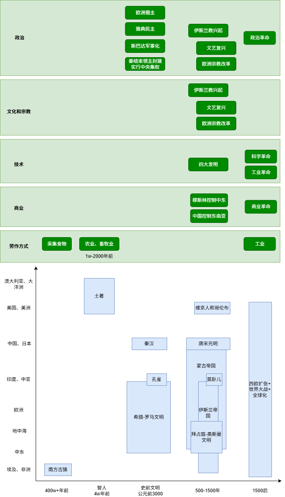

# 全球通史
[全球通史 7th，斯塔夫里阿诺斯1998](https://book.douban.com/subject/36609039/)

打破了传统的“西方中心论”，把整个世界看作一个不可分割的有机整体，从全球的视角来考察不同文明的产生和发展。

各大文明由于受限于技术和地理环境，孤立发展。到地理大发现，西方霸权崛起，将世界连接到一起。

[全球通史, 斯波德克Howard Spodek](https://book.douban.com/subject/30398015/)  

[人类简史, 赫拉利](https://book.douban.com/subject/37295054/)

# 发现社会

[历史学与社会理论](https://book.douban.com/subject/34842935/)  

[发现社会, 西方社会学思想述评](https://book.douban.com/subject/25924609/)  

[家庭、私有制和国家的起源](https://book.douban.com/subject/27194805/)  

# 宗教、战争和地缘
[芯片战争, 米勒](https://book.douban.com/subject/36350632/)  

# 战略和国家安全
