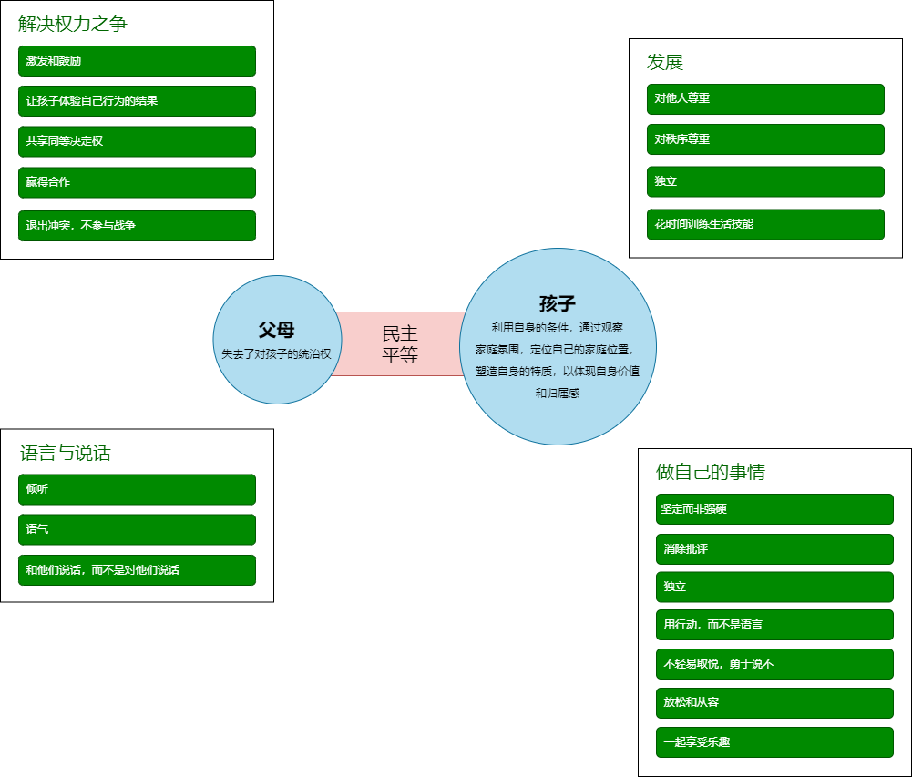

开放与好奇心

人性、情绪、动机、行为

https://further.net/

https://blog.samaltman.com/productivity

https://www.cyzone.cn/article/621131.html

https://jamesclear.com/why-facts-dont-change-minds

https://jamesclear.com/3-2-1/may-25-2023

https://developer.aliyun.com/article/1179144

https://therapistuncensored.com/

https://web.mit.edu/

# 自我、性格与职业规划

[Turnaround for Child, brizard2016](https://turnaroundusa.org/what-we-do/tools/building-blocks/)  

[LOUISIANA HIGH SCHOOL PLANNING GUIDEBOOK](https://www.louisianabelieves.com/docs/default-source/course-choice/high-school-planning-guidebook.pdf?sfvrsn=36)

[盖洛普优势识别器 2.0]()

[MBTI](https://www.16personalities.com/ch/%E7%B1%BB%E5%9E%8B%E6%8F%8F%E8%BF%B0)

[在线工具-人格测试](https://www.zxgj.cn/g/dawujianban)

[高敏感是种天赋]()

[The road back to you]()

[专注力就是你的超能力]()

[安静 内向性格的竞争力](https://book.douban.com/subject/11601993/)

[自尊](https://book.douban.com/subject/30408726/)

[活出最乐观的自己](https://book.douban.com/subject/4934590/)

[发现你的天赋]()

本书其实讲的是The element，一种充分发挥自身优势和热情的状态。
核心是通过了解自身人格，SWOT分析后，调整自身的状态。

[九型人格]()

[人性的弱点]()

# 玩耍与游戏力

# 养育、教育、亲子关系

教化与教育

> 教育前沿跟踪、教育发展主要指标及其趋势比较研究
> 全球化背景下中国特色基础教育发展

[推动在线教育转型升级](https://iwaes.gmw.cn/show/detail.jsp?newsID=%2BPzoCcfQMLs%3D)

[中国教育三十人论坛](https://www.master-insight.com/author/zhongguojiaoyusanshirenluntan/)

[面向未来的教育：培养21世纪核心素养的全球经验](https://www.wise-qatar.org/app/uploads/2019/04/wise_research21st_century_skills_chinese.pdf)

[教育部印发《普通高中学校办学质量评价指南》](http://www.moe.gov.cn/jyb_xwfb/gzdt_gzdt/s5987/202201/t20220110_593455.html)

[中小学教育质量综合评价指标框架（试行）](https://wenku.baidu.com/view/fd4826785bfafab069dc5022aaea998fcc22403d.html?_wkts_=1690086659977&bdQuery=%E4%B8%AD%E5%B0%8F%E5%AD%A6%E6%95%99%E8%82%B2%E8%B4%A8%E9%87%8F%E7%BB%BC%E5%90%88%E8%AF%84%E4%BB%B7%E6%8C%87%E6%A0%87%E6%A1%86%E6%9E%B6)

[教育部等六部门关于印发《义务教育质量评价指南》的通知](http://www.moe.gov.cn/srcsite/A06/s3321/202103/t20210317_520238.html)

[北京市十一学校行动纲要](https://www.sohu.com/a/658734706_100934)

[孩子：挑战](https://book.douban.com/subject/35200665/)  

人们逐渐明白了：人生而平等。每个人都有为自己做决定的权利。  
我们只能在遵守规则的前提下拥有自由，这个规则不是独裁者或者权威机构为自身利益而设，而是为了维护社会整体利益，每个个体都应当遵循。  
我们不能再强迫孩子绝对顺从，而应该用激发和鼓励的方式，让孩子主动遵循应有的规则。 

[让孩子性格好、身体好、学习好]()

[真希望我父母读过这本书]()

[伯克毕生发展心理学, berk2014](https://book.douban.com/subject/25773343/)  
更好的看待和养育孩子。  
结合论文，详细介绍了人的一生每个重要阶段生理和心理的发展情况。  
儿童从出生到青年，身体发育、自我理解、语言发展、情绪管理。  
家庭教养方式、社会大环境的影响。

[准备]()  
看似讲Submit高中的运作逻辑-何为一所好的学校，另一方面激发我们家长分析自己的问题。
核心是**人生设计**，通过习得通用的生活技能和学术知识，每个孩子都会过上满足的人生。  
为了找到自己想要什么，我们是否可以**列出目录**，穷举所有可能的人类活动（所有的职业、其他人分享的成就）  

[Diane Tavenner共享的教养工具箱](https://preparedparents.org/resources/)

[The Challenge](https://book.douban.com/subject/26304087/)

# 学习科学

> 学校统一教，孩子个性化的学

[Knowns & unknowns, 96](http://matt.colorado.edu/teaching/highcog/fall8/nbbbbchlpsu96.pdf)  
[Working memory capacity, 2003](http://matt.colorado.edu/teaching/highcog/fall8/cke3.pdf)  
[Metacognition and Cognitive Monitoring, Flavell79](https://pdfs.semanticscholar.org/ee65/2f0f63ed5b0cfe0af4cb4ea76b2ecf790c8d.pdf)  
[perception in chess, simon73](http://matt.colorado.edu/teaching/highcog/fall8/cs73.pdf)  

[为什么学生不喜欢上学，Willingham.D.T.2010](https://book.douban.com/subject/4864832/)  
从认识理论发展的结论分析，承认大脑的各种缺陷是造成大家学习上的各种困难的根源。  
迁移知识、持久练习`使得背景知识演变成中心知识`。 

[聪明在于勤奋，天才在于积累, 华罗庚06](https://book.douban.com/subject/1973934/)  
怎样才算会读书。  
由薄到厚，接受前人成就。先通过分治和发散思维，接受和记忆新知识。增加注释和阅读文献使得书变厚。  
由厚到薄，又能独立思考。再通过聚合和独立思考，去粗取精、去伪存真、由此及彼、由表及里。将全书各部分串联起来理解，弄清主要问题，以及各个问题之间的关联。  
搞科研的态度：开辟方向 > 创造方法 > 模仿、成法解决新问题。  

懂的部分，可以快速略过；要紧的，需要重点专研。对自己来说，一本书新的内容加入到自己的体系中，形成飞轮效应。  

[掌控习惯, clear](https://book.douban.com/subject/34326931/)

我们每天的行动中有40%至50%都出自习惯。  
微习惯=原子习惯=边际收益=1%的改进=长期主义=自我提高的复利    
身份认同控制大方向，体系是过程控制。  
成功的最大威胁不是失败，而是倦怠。  
专业人员依照既定计划行事，毫不动摇；业余爱好者则随波逐流，任性而为。  
**积极性和好奇心**比头脑灵活更重要，因为前者会导致行动。  
满意=喜欢-想要  

https://www.scientificamerican.com/article/how-the-brain-makes-and-breaks-habits/

http://blog.idonethis.com/the-biology-of-productivity/

https://www.healthline.com/health/the-science-of-habit#1

[刻意练习, ericsson2016](https://book.douban.com/subject/26895993/)

[five-stage-model-mental-activities-involved-directed-skill-acquisition, dreyfus80](https://www.researchgate.net/publication/235125013_A_Five-Stage_Model_of_the_Mental_Activities_Involved_in_Directed_Skill_Acquisition)

[make it stick, brow2014](file:///Users/liangge/Desktop/kupdf.net_make-it-stick-the-science-of-successful-learning.pdf)

[thinking fast slow](https://paulminors.com/blog/thinking-fast-slow-book-summary-pdf/)

[learning theories, schunk2011](https://book.douban.com/subject/10579469/?from=tag)

http://matt.colorado.edu/teaching/highcog/fall8/  
https://en.wikipedia.org/wiki/Learning_theory_(education)  

# 情绪、情商、心理健康

作为人类的核心是什么，同理心和创造力，社交能力、情感交际能力

[教育的“情感转向”与“全人”培养](https://iwaes.gmw.cn/show/detail.jsp?newsID=yv1yDZLbdhI%3D)

[中国青少年社会与情感能力发展水平报告](https://xbjk.ecnu.edu.cn/EN/article/downloadArticleFile.do?attachType=PDF&id=9491)

[讲座实录 | 黄忠敬：国际视野下的中国学生社会与情感能力测评与实践（上）](https://untec.shnu.edu.cn/98/28/c27591a759848/page.htm)

[SEL](https://casel.org/)

[拥抱你的敏感情绪：疗愈情绪，接纳自我](https://book.douban.com/subject/35219805/)

[成功心理学](https://book.douban.com/subject/26807400/)

[不被父母控制的人生](https://book.douban.com/subject/35279820/)

[自信的陷阱](https://book.douban.com/subject/34846270/)

[伯恩斯新情绪疗法Ⅱ](https://book.douban.com/subject/26972590/)

[清醒地活](https://book.douban.com/subject/35581777/)

[被讨厌的勇气](https://book.douban.com/subject/26369699/)

[情商系列，戈尔曼](https://book.douban.com/subject/30181152/)

戈尔曼的这个情商共有6本，涵盖社交、工作、领导力、生态，以及如何提高。  

[情商2.0：如何测量和提升自己的情商](https://book.douban.com/subject/34667959/)

https://www.commonsense.org/education/articles/teachers-essential-guide-to-social-and-emotional-learning-in-digital-life?campaignid=14648366524&adgroupid=128855787282&adid=545770796344&gclid=Cj0KCQjw_O2lBhCFARIsAB0E8B_W9mf-uF4rMJfrMOsh4BthMIePizbjYUbe432nKONwXwmH_JPQWYgaAms9EALw_wcB

# 心理学
[心理学导论，mitterer07](https://book.douban.com/subject/2125973/)  

[伍尔福克教育心理学, woolfolk2015](https://book.douban.com/subject/26744183/)  

[这才是心理学，2020](https://book.douban.com/subject/35023259/)  

[蛤蟆先生去看心理医生](https://book.douban.com/subject/35143790/)  

基于TA沟通分析心理学的理论，可以看到心理咨询的倾听、共情、沟通技巧，也可以看到一个标准的心理咨询流程的模板 