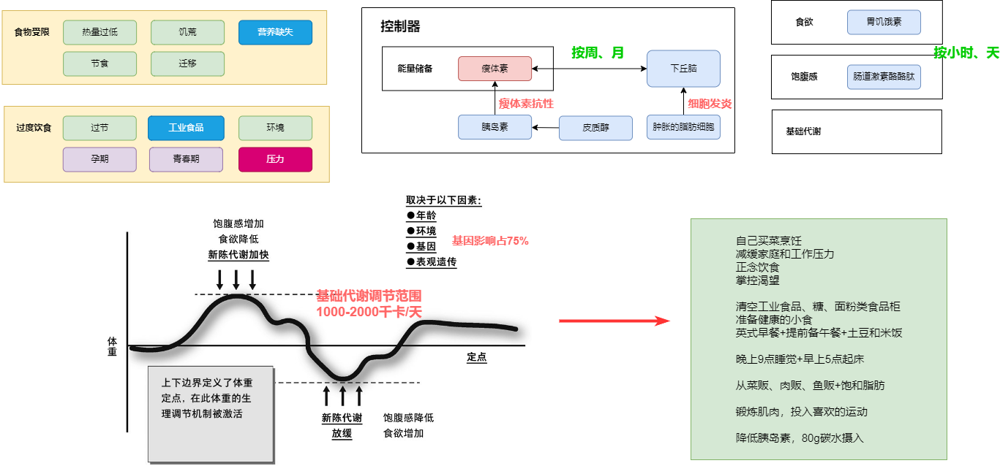
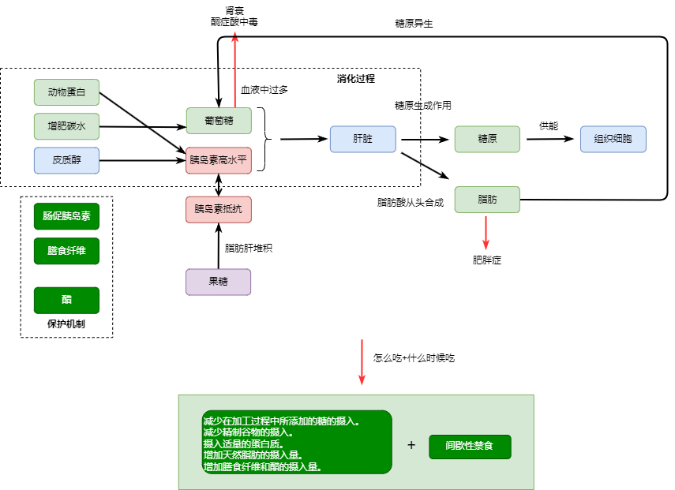

# 人类文明、现代体育

[Physical Fitness History](https://www.lovetoknowhealth.com/fitness/physical-fitness-history)  
孔子最早在六艺中提及射和御，奠定了价值观，从而有了功夫、摔跤和羽毛球的发展。  

古希腊通过艺术和军事的推动体形，在整个欧洲发展了体操。  

工业革命带来的生活方式的改变，造成了飙升的心脏病和糖尿病发病率，引起了政府和军队的注意，在健身房进行的健身行业的爆炸式发展，但这不是人类文明的初心。  

[健康中国2030”规划纲要](https://www.gov.cn/zhengce/2016-10/25/content_5124174.htm)  
推进健康中国建设，是全面建成小康社会、基本实现社会主义现代化的重要基础，是全面提升中华民族健康素质、实现人民健康与经济社会协调发展的国家战略，是积极参与全球健康治理、履行2030年可持续发展议程国际承诺的重大举措

[健康中国行动（2019—2030年）](http://www.nhc.gov.cn/guihuaxxs/s3585u/201907/e9275fb95d5b4295be8308415d4cd1b2.shtml)  
规定了角色、重大指标、活动

[树立健康新理念 建立健康生活方式](https://www.ggj.gov.cn/zgjghq/2012/201206/201206/t20120612_19265.htm)  
针对现代健康定义做出解释

[国民体质测定标准（2023年修订）](https://www.sport.gov.cn/n315/n20001395/c25880704/part/25880716.pdf)  
新标准针对当前我国幼儿、成年人和老年人需要提升平衡能力、心肺功能、肌肉力量等现实需求。  
体质水平=身体形态15%+机能25%+素质60%  

[国民体质监测公报](https://www.gov.cn/guoqing/2023-03/12/content_5745851.htm)  
中国政府每5年发布一次国家国民体质监测公报，系统分析了国民体质的基本情况、特征和变化规律。  

[2022 年中国居民健康素养监测情况](https://www.gov.cn/lianbo/bumen/202308/P020230822019124684406.pdf)

[Healthy Living Guide 2020/2021, Harvard T.H.CHAN](https://www.hsph.harvard.edu/nutritionsource/2021/01/19/healthy-living-guide-2020-2021/)

[程序员延寿指南](https://github.com/geekan/HowToLiveLonger)  
收集所有已证明，显著影响ACM的活动。（具有实际意义）    

[程序员防猝死指南](https://www.cnblogs.com/anding/p/16482341.html)  
主要是围绕健身周围的一系列知识和实用的活动指南。

# 睡眠

[美国国家睡眠基金会](https://www.sleepfoundation.org/)

[Improving Sleep: A guide to a good night's rest, harvard](https://books.google.com/books?id=G8lL1ZhvZjIC&printsec=frontcover&hl=zh-CN&source=gbs_ge_summary_r&cad=0#v=onepage&q&f=false)

[YOUR GUIDE TO Healthy Sleep, nih](https://www.nhlbi.nih.gov/files/docs/public/sleep/healthy_sleep.pdf)

[Sleep resources guidebook](http://www.promoinfotools.com/Communications/ecard/Svcs/BetterSleep/SleepGuidebook_RFL.pdf)

[Nathaniel Kleitman, PhD, Kleitman99](https://www.uchicagomedicine.org/forefront/news/nathaniel-kleitman-phd-1895-1999)

Kleitman在猛犸洞里证明了一项惊人的科学发现，人类的昼夜节律大约是一天。  

[Physiology of Sleep, carley2016](https://www.ncbi.nlm.nih.gov/pmc/articles/PMC4755451/)

[我们为什么要睡觉？](https://book.douban.com/subject/35332778/)

超过65%的美国成年人在一周中没有一天晚上得到了7~9小时的建议睡眠时间。  
人类（以及所有其他物种）永远不能把我们之前失去的睡眠“睡回来”。 

一生的睡觉时间

| 阶段  | 睡觉时间  |时长|备注|
|---|---|---|---|
|出生前   |   |24, 6REM+6NREM+12|肌肉抑制系统不健全|
|幼儿   |   |11小时|逐渐双相睡眠，NREM:REM=80:20|
|9岁   |8pm入睡，9pm睡着   |10小时, 9-12||
|16岁   |11pm入睡  |9小时, 8-10 |节律器比父母晚|
|成年人   |10pm  |8小时, 7+ |
|中老年人   |8pm |8小时 |慢波质量和数量降低，记忆衰退，频繁清醒，节律器提前，但腺苷压力不足

# 健康膳食

> 吃什么和喝什么能满足营养需求，促进健康，并减少慢性疾病的风险
> 

## 食物、营养摄入

[东方健康膳食模式「Eastern healthy diet pattern」 浅析](https://zhuanlan.zhihu.com/p/569173134)

[中国食物成分表](http://www.hyyhealth.com/food)

[食品营养标签管理规范](https://www.gov.cn/gzdt/2008-01/11/content_856260.htm)  
它显示了食品的营养特性和相关营养学信息，是消费者了解食品营养组分和特征的主要途径。

[中国居民膳食指南](http://dg.cnsoc.org/article/04/x8zaxCk7QQ2wXw9UnNXJ_A.html)

【强调蔬菜+奶制品】> （水果+谷类） > 动物 > （薯+豆）  
建议(1个鸡蛋+200g牛奶)+（150g廋肉+1小团蔬菜+1小团碳水）+（1小团谷薯+1小团蔬菜+1个苹果）  

| 营养  | 摄入量  |推荐|美国标准|中国标准|国内平均
|---|---|---|---|---|---|
|蛋白   | 8个鸡蛋=4斤牛奶=半斤鸡胸肉=3个鸡腿  |廋肉1两+鱼1两+1两大豆+半斤牛奶+1个鸡蛋 |56g|70g|65g
|碳水   | 100g土豆=100g红薯=15g碳水  |不能一味追求低GI  |130g|400-600g|300g
|脂肪   | 鱼+坚果+鸡蛋  |大部分是18:2, 18:3  |20-35g|70g|80g

- 上述是31-50男性178cm, 70kg  
- 女性163cm, 57kg, 蛋白质大概摄入的0.8  
- 青少年蛋白质大概是女性的0.8，钙比成人需要更多

[中国居民膳食指南科学研究报告2021](https://www.chinanutri.cn/yyjkzxpt/yyjkkpzx/yytsg/zgjm/202103/P020210311486742870527.pdf)  
对膳食指南进行证据、观点分析和总结。  

[2023中国与全球食物政策报告](http://agfep.cau.edu.cn/art/2023/4/22/art_39031_962628.html)

[美国国家农业库-人类营养和食物安全](https://www.nal.usda.gov/human-nutrition-and-food-safety)  
上面有每种食物的成分库、营养库  
膳食指南  
各种跟食品相关的论文  

[美国居民膳食指南（2020-2025）](https://healthcare.utah.edu/sites/g/files/zrelqx136/files/media/documents/2023/Dietary_Guidelines_for_Americans_2020-2025-compressed_1.pdf)

- 提供了一份健康饮食框架。这个框架可以满足和自定义，以满足个体和不同的饮食文化。  
- 整个生命周期都按照这份健康饮食模式。  
- 关注食物组，满足高营养密度食物、饮料和热量限制。每餐都有一半是蔬菜和水果，全谷物加入谷物的一半，喝低脂的奶制品、豆制品。  
- 限制糖、饱和脂肪、盐的摄入。  

[膳食营养索参考摄入量,dri](https://www.nal.usda.gov/human-nutrition-and-food-safety/dri-calculator/results)  
根据年龄、身高、体重、活动量，估算出每天的基本能量消耗，根据每个营养素功能比例，给出估计的摄入量和食谱。  

[MyPlate](https://www.myplate.gov/)  
根据身高、体重、活动量，计算每天各种营养素的摄入量

https://dtc.ucsf.edu/

## 基础代谢、热量控制、减脂、健身营养

https://www.jirou.com/tool/reliang.php

[41%中国男人超重，只有这个省最苗条](https://36kr.com/p/2419627248689924)  
男性40-60超重呈现增长模式  
北方小麦饮食模式，碳水摄入量和能力比高  
肥胖与经济水平的相关性高  

[成人肥胖食养指南](http://www.nhc.gov.cn/cms-search/downFiles/a144741bc7a7469fbbf4a98efe614035.pdf)  
根据营养科学理论、中医理论和目前膳食相关肥胖科学研究文献证据，在专家组共同讨论、建立共识的基础上，对成人肥胖患者的日常食养提出 6 条原则和建议。

还根据不同地区，给出了一年四季、一日三餐的菜单和食谱。 

[我们为什么吃（太多）：食欲的新科学](https://book.douban.com/subject/36469148/)

我们一天24小时躺在床上，仍旧会消耗掉平日里70%的能量——通过呼吸、心跳、体温控制以及体内所有细胞的化学反应。身体的这些下意识活动所需的能量被称为“基础代谢率”(BMR)。对于理解我们自身的新陈代谢来说，认识到2/3的日常能量消耗并不受意识控制。  
尽管表面上看来，我们吃多少是由意识所掌控，但实际上，**大脑中的潜意识左右了潜在的饥饿感和进食行为**。  
与节食前相比，胃饥饿素信号全天高出24%。  
而与节食前水平相比，胃饥饿素水平（因而也代表食欲水平）保持在高位，酪酪肽水平（饱腹感）保持在低位。节食不仅没能让体重持续减轻，同时节食者的食欲信号和饱腹信号即便在他们停止节食整整一年后，仍处于混乱之中。  

家庭环境对肥胖水平的影响仅有区区10%。**因此，如果一个孩子变胖了，75%的原因是来自他自己的基因**，10%来自父母养育和家庭环境的影响。  

成年男性平均每天摄入约2500千卡能量，相当于每天1050万焦耳的能量。一天有86400秒。从中我们可以计算出普通成年男性消耗能量的比率（或功率）。人体运行所需的功率是120瓦——与点亮一个灯泡的功率相当。  

今天的青少年在离开家庭进入陌生的大学世界时，也会产生同一种应激激素。在用皮质醇药物治疗炎症时，会产生食欲激增和觅食行为（还会让人感到略微兴奋，这能解释很多新生的行为）的副作用。增加的食欲导致了体重的增加。更高的皮质醇水平由此导致体重定点的升高，这解释了大一新生经常会增重5.5千克的现象。睡眠、锻炼、音乐、按摩、跳舞和欢笑都能够帮助你降低皮质醇水平。  

[你是你吃出来的, 夏萌2017](https://book.douban.com/subject/27590675/)  
[你是你吃出来的2, 夏萌2021](https://book.douban.com/subject/35340053/)

比如血管的内皮细胞1天就会死亡；胃黏膜细胞3～5天更替一次；肺表面的细胞寿命是2～3周；皮肤最外面的角质层细胞28天左右就要换新；肝细胞能存活150天左右；心脏细胞更新速度要慢很多，大约需要20年；

我们最常见的冠心病、高血压、糖尿病、肿瘤、抑郁症、气管炎、哮喘、慢性肾病等疾病，都是由不恰当的生活方式引起的，医学工作者将这些疾病统一归类为慢性非传染性疾病，简称**慢病**。

追根究底，慢病源于各种不平衡，比如缺乏睡眠、长期吸烟、大量饮酒、不运动或者运动过量、饮食不平衡、压力太大，等等

碳水化合物每克产生4千卡能量，蛋白质每克产生4千卡能量，脂类每克产生9千卡能量。

缺乏蛋白质，所以肌肉无力，消化能力差，睡眠不好。

缺乏必需脂肪酸，所以皮肤干燥，视力很差，记忆力减退。

一般来讲
- 轻体力劳动者[注：轻体力劳动者：75%时间坐或站立，25%时间站着活动，如从事办公室工作、修理电器、售货员等。]是标准体重每千克耗能30千卡，
- 中体力劳动者[注：中体力劳动者：25%时间坐或站立，75%时间特殊职业活动，如学生日常生活、机动车驾驶员、电工、安装人员、车床操作者、从事金属切割的人员等。]35千卡，
- 重体力劳动者[注：重体力劳动者：40%时间坐或站立，60%时间特殊职业活动，如从事非机械化农业劳动，炼钢、舞蹈、体育活动、装卸、采矿等。]40千卡，
- 长期卧床的人标准体重每千克耗能25千卡。

临床上我们也不是这么绝对，比如一个轻体力劳动者，偏胖，计算能量的时候减少5千卡，为标准体重每千克耗能25千卡。

大多数营养书上三大能量比例是蛋白质为10%～15% ，脂类为20%～30% ，碳水化合物为55%～65%。

满分早餐=2个鸡蛋+200牛奶+蔬菜水果（包子+鸡蛋+果蔬汁）

按书中所需能力计算所得：

| 营养  |标准   |当前
|---|---|---|
| 体重  | 179-105=74kg  |80:arrow_up:	
| 能量  | 轻体力74*30=2220大卡  |输入1000-, 输出2157
| 碳水  | 55%*2220/4=305  |102:arrow_down:	
| 蛋白质  | 15%*2220/4=83.25 |50:arrow_down:	
| 脂肪  | 2220*20%/9=50|33:arrow_down:	

早餐：豆浆+鸡蛋（68+66=134大卡）  
午/晚餐：土豆100g+西兰花150g+1个鸡腿（69+40+120=229大卡）

input=872大卡+1个苹果（80卡）+牛奶130=1050大卡

output=250大卡步行+100健身+1807基础=2157大卡

[肥胖代码](https://book.douban.com/subject/34906442/)  
人体具有基本的**生物内稳态**特征，如果某一生理过程向一个方向变化，则身体会做出反应，将向另一个方向改变以保持原来的状态。换句话说，身体会产生耐受力。身体不在它的舒适区时，为了适应环境会出现**抵抗**。  

1焦耳的橄榄油和1焦耳的糖会发生同样的代谢反应吗？答案显然是否定的，可以发现这两种食物有很多不同。糖会升高血糖水平，并促使胰腺分泌胰岛素。  

体重减轻会引发两个重要反应。第一，身体为了节约能量，将总能量消耗立即且无限期地降低。第二，为了获得更多的食物，内分泌系统发出的饥饿信号立即且无限期地增强。  

补偿机制=运动量增加导致热量摄入增加，**剧烈运动后我们吃得更多** + 补偿机制与非运动性活动的减少有关。如果你一天都在努力工作或学习，你就不太可能在休息时再做运动。  

在肥胖症进展过程中，进食次数增加的影响力是膳食结构调整的两倍。  

[健身营养全书](https://book.douban.com/subject/30157798/)  

# 健康教育

[国家体育锻炼标准工作指导手册](https://www.sport.gov.cn/n322/n382/c958111/part/606432.pdf)  
《国家体育锻炼标准》适用于 6~69 周岁的健康公民，按年龄分为儿童、少年、青年、壮年和老年五个组别，每个组别分男、女两类人群。测验项目类别涵盖人体的速度、耐力、力量、灵敏、柔韧五类身体素质。  

[国家学生体质健康标准（2014年修订）](http://www.moe.gov.cn/s78/A17/twys_left/moe_938/moe_792/s3273/201407/t20140708_171692.html)  
是国家学校教育工作的基础性指导文件和教育质量基本标准，是评价学生综合素质、评估学校工作和衡量各地教育发展的重要依据。  

[不同国家学生体质监测体系的发展](http://www.cjsh.org.cn/cn/article/doi/10.16835/j.cnki.1000-9817.2022.01.034?viewType=HTML)

[中小学健康教育规范](http://www.nhc.gov.cn/wjw/pqt/201207/55285/files/1ae6e10aea834e59903d530feda8b8ff.pdf)

[教育部关于印发《普通高等学校健康教育指导纲要》的通知](http://www.moe.gov.cn/srcsite/A17/moe_943/moe_946/201707/t20170710_308998.html)

[学生餐营养指南](http://www.nhc.gov.cn/ewebeditor/uploadfile/2018/06/20180613135619237.pdf)

[中小学生每天锻炼两小时能实现吗？其实运动时间可以化整为零](https://news.bjd.com.cn/tech/2021/02/03/47423t133.html)

[学校心理健康教育三十年](https://deyu.usst.edu.cn/_upload/article/files/0b/b6/29111aaf4580bbae5e5a64adcb09/bdb42a88-1b9d-4dd0-a830-e093c9f5a221.pdf)

[体育学科核心素养研究的国际经验与启示]()  
