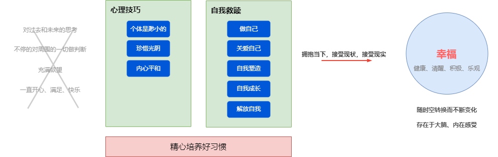
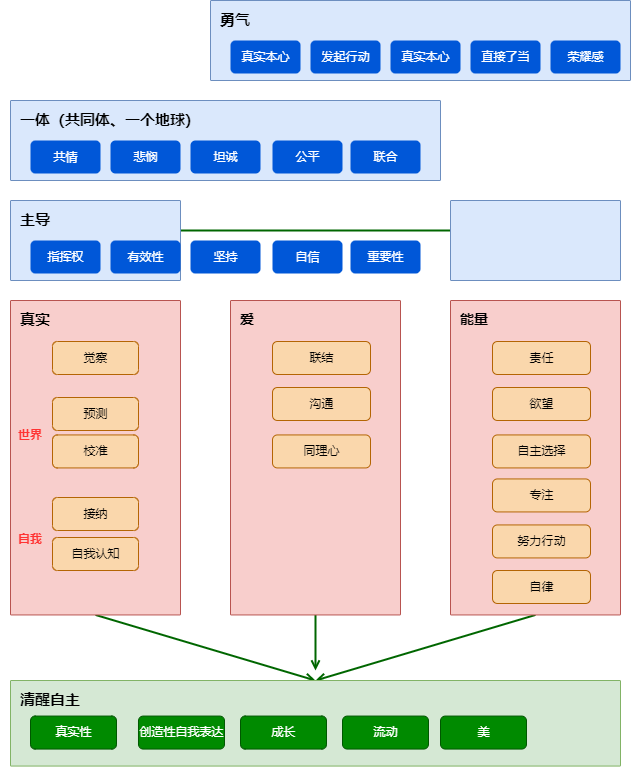
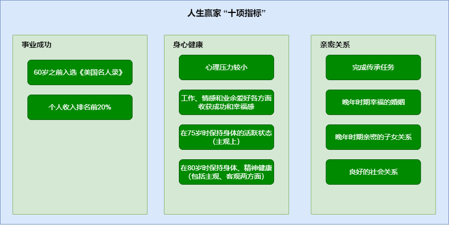
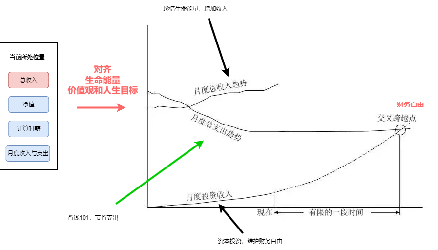
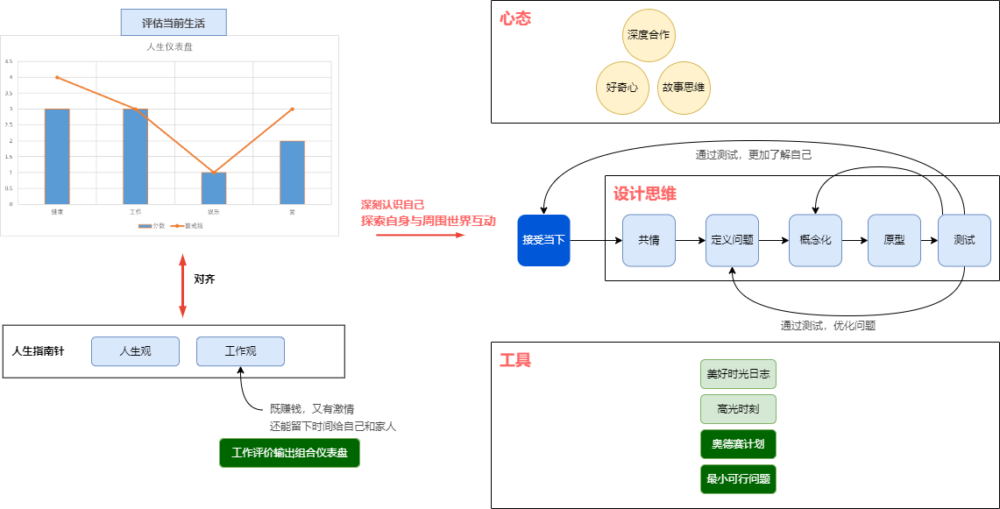

https://ideas.ted.com/tag/how-to-be-a-better-human/

http://lifedesignlab.stanford.edu/
  

# 幸福人生

[The Global Rise of Unhappiness](https://news.gallup.com/opinion/gallup/401216/global-rise-unhappiness.aspx)

[纳瓦尔宝典](https://book.douban.com/subject/35876121/)  

> 最难的不是做自己想做的事，而是知道自己想要什么。

[当下的力量]()

[哈佛幸福课]()  
人们很容易忽略一些明显的问题。  
积极心理学的本质就是健康本源。
健康模型更注重培养能力，而不只是改正错误。  
心理学关注的不仅仅是疾病和健康，还包括工作、教育、洞察力、爱、成长和玩乐。  

[生命安宁](https://book.douban.com/subject/24732489/)  

斯多葛主义总体的思路就是通过建立高远的目标，利用心理技巧和正确的人生哲学，最终得到安宁的生活。  
  
为了抑制享乐适应，需要间歇性地想象坏事发生。（跳出舒适区）  
把事情分类成完全控制、部分控制、无法控制，内化目标。
把事情分类成过去、现在和未来，现在和过去无法改变，着眼未来。  
生活得好像坏事已经发生。（自律）

https://howsoul.io/article/Vwd1bYEDy

# 人生价值

[做一个有灵魂的人](https://news.sina.cn/sa/2008-01-10/detail-ikkntian0040144.d.html?from=wap)  
丰富”是指人不仅有生命，还有精神，这是人和动物更重要的区别。人有**精神能力**，而动物只有生存本能。“丰富”就是要让人的精神能力生长、开花、结果，每个人都要如此，这就是精神上的丰富。人有哪些精神能力呢？古希腊哲学家柏拉图把人的精神能力分为三种，智、情、意。“智”是指思考能力。“情”就是情感，人有情感生活，有对爱的体验，有对美的体验。“意”是指意志，就是能够支配自己的行为，按照道德做事，也就是对“善”的追求，这可以说就是信仰。所以，“智”、“情”、“意”就是人的智力生活、情感生活和信仰生活，这三种生活组成了人的精神生活。所谓的“丰富”就是指人应该过这三种生活，三者缺一不可。智力生活与“真”相对应，情感生活对应的是“美”，信仰生活对应“善”。“智”与科学相对应，“情”对应于艺术、文学，“意”对应哲学、宗教。人类应该去享受这些东西，而不是单纯地生活在外在世界上。

人应该过智力生活，头脑是上天给人的一个恩赐，因为人有头脑，所以对世界充满好奇心、充满兴趣，能够进行独立思考。这是人类最可贵的禀赋，在运用这种能力的时候，本身就是一种快乐，一种享受。

怎么样去“丰富”呢？我觉得有三个途径。首先，要养成独处的习惯。哲学是一种分身术，可以把一个人变成两个人。肉身的自我可以在社会上奋斗，但一定还要有一个更高的自我，每个人的身上都应该有一个更高的自我。怎样才能有一个更高的自我呢？首先，就是要有独处的习惯，经常反思一下自己。第二，通过读书来形成更高的自我。阅读本身就应该是精神生活，让人感到精神上的愉悦、精神上的启迪，这样的读书才是有意义的，才是真正的阅读。阅读的过程是人的灵魂提升的过程，多和大师们交流，慢慢地，读者和大师的精神就接近了，能从大师的角度去看世界了，这是多大的愉快啊！

一个优秀的人应该养成过智力生活的习惯，让自己的好奇心和求知欲始终处在活跃的状态，另外，要有一种自主学习的能力，所有的大科学家、大学者始终保持着智力活动的习惯，这是一种高品质。第三，是通过实践完善人的社会性。在实践中，人的社会性可以不断完善，还可以找到自己的兴趣，心灵丰富起来，脱离纯粹物质的需求。

我觉得成功应该是“优秀”的“副产品”，要努力成为一个优秀的人，智力生活要始终是活跃的，情感生活要始终是丰富的。

[给青年的十二封信, 朱光潜2014](https://book.douban.com/subject/26253561/)

[聪明人的个人成长, pavlina08](https://book.douban.com/subject/36018994/)

作者尝试给出一个框架，来帮助总结个人成长背后的规律。  
教你如何在生活中的所有领域，都能够良好运用个人成长的通用原则。成为一个具备清醒自主意识的人。可以用它们去改善生活中的不同领域。    

> 接纳现实真相，放下无知、虚伪和否认，不断调整对世界和自我的认知。  
> 通过彼此的相处和协同，建立更深层次的联结。  
> 放弃懒散、胆怯和懦弱，变得有能力运用自己的能量、为自己的人生全权负责。  

习惯是一种自动储存的解决方案。建立起足够多的好习惯，让自己每天都感到充满能量、思维敏捷，而不是每天疲惫不堪、疾病缠身。    
找到财务安全感的最简单方法，**是坦然接纳自己确实存在破产、身无分文的可能性。尽自己最大的努力，去创造并分享价值**，你会推动这个世界变得更加富足，而这最终将使每一个人都受益。    
你可以充分利用自己健康的身体，去做更多有创造性的事情。  
**请尽你的最大努力，用真实的自我去和他人建立联结**。这些关系不见得是完美的，但完美本身也没有必要。  

[那些比拼命努力更重要的事](https://book.douban.com/subject/36069334/)  
格兰特研究开始于1938年。当时医学研究主要关注于病理，而格兰特研究则尝试着反其道而行之，了解人的最佳健康状态和最佳潜能以及增长这种状态和潜能的条件。第一批受研究对象是从哈佛大学1939、1940和1941届本科生（当时三届学生全是男生）中精挑细选出来的64名大二学生，他们接受了密集的测试和访问。之后，我们又挑选了后面三届的一些大二学生，最终形成了一个268人的实验组。

实际上，前辈们在1938年的时候想要知道的某些问题现在已经有了答案：哪些人能活到90岁并且还依然身体健康、思维活跃？哪些人能拥有幸福长久的婚姻？哪些人能够取得传统意义上的（或非传统意义上的）事业成功？最重要的是，在研究这些结果产生的原因时，我们有75年的数据供我们随时参考。

**人的确是不断变化、不断成长的**。童年并不能决定人的一生。  

**情感经历是塑造人格的根本因素**，婴儿依赖妈妈不是因为妈妈喂饱了他们，而是因为妈妈抱了他们，给他们唱歌，凝视它们的眼睛。  

在人生某一阶段中正确的东西，在另一阶段并不一定仍然正确。  

[成长，谢耘10](https://book.douban.com/subject/4812990/)

[曾国藩家书](https://book.douban.com/subject/26826152/)

[Dimensions of wellness: Change your habits, change your life](https://www.ncbi.nlm.nih.gov/pmc/articles/PMC5508938/)

# 生活态度、方式

[去，过你想要的人生](https://book.douban.com/subject/26337890/)

书里列出的书单是特色。  

[要钱还是要生活](https://book.douban.com/subject/35611477/)

本书第一次提出FIRE生活。这本书并不是一本理财书。它是一份个人发展指南，帮助你厘清自己真正想要的生活，同时训练你改掉可能已经形成的乱花钱的坏习惯。改变人看待钱、挣钱、花钱和攒钱的方式。     

FIRE更像是一连串休假：工作，存钱，投资，辞掉有偿就业去旅行、学习、育儿或进修，几个月或者几年后重新进入有偿就业。  

我们所说的“**财务自由**”是什么意思呢？从最基本的层面上讲，财务自由的意思就是不必再为了钱而工作。不止如此，本书将带你完成解放自我的过程。  

我们已经发现几个**被普遍认同的人类幸福要素**，对每个人都适用。比如，友谊、健康、社群归属、用自己的智慧迎接挑战，以及能掌控生活的感觉等，这些都是幸福感的来源。

我们难道不是在为了工作而扼杀自己，扼杀我们的健康、我们的人际关系、我们的愉悦与好奇心吗？我们在为了钱而牺牲自己的生命，但这个过程很慢很慢，我们几乎毫无察觉。时光流逝的标志唯有苍白的鬓角、**渐粗的腰围**，还有隐隐约约的进步迹象，如高级办公室、公务车或高层职位。最终，我们或许拥有了想要的全部必需用品、有品位的艺术品乃至奢侈品，**但我们已陷入朝九晚五的模式不能自拔**。毕竟，如果我们不工作，时间怎么打发呢？我们曾经想通过就业来寻找意义与成就，这个梦想在职场倾轧、殚精竭虑、无聊沉闷和激烈竞争的现实中逐渐消散。小时候的好奇心、大学时代的使命感、我们与挚友彼此爱惜的岁月都被遗忘——全都付诸“那时我们真年轻”的感叹。  

当我们达到满足感曲线的顶点，说明我们拥有的**足够**了。有足够的必需品供生存，有足够的美好享受带来舒适和愉悦，甚至有足够的小小“奢华”。我们拥有自己需要的一切；没有任何额外的东西让我们心烦意乱、分散精力或苦恼不堪，没有任何东西是我们刷卡购买后一直闲置不用却还在辛辛苦苦为它还账单的。  

我们可以重新给“工作”下定义——凡是我们所做的与人生目标一致的事情都叫“工作”。工作有两个方面：一方面是我们对金钱的需要和渴望，我们工作是为了得到报酬来满足人的基本需求；另一方面与我们的薪资毫不相干——我们工作是为了实现人生中的许多其他积极目标。  

[最优解人生](https://book.douban.com/subject/36242339/)
人生须尽兴，而不仅是图存活。本书不是教你如何增长财富，而是如何充实人生。  
你的人生是你体验的总和。**我们人生的目标不是为了最大化财富，而是把体验最大化**。  
旅行是衡量一个人金钱享受能力的终极标准，因为旅行要花钱、花时间，尤其要有好的身体。  
我们在人生的不同阶段对各种体验的享受能力会发生变化。  
尽管我们每个人都至少有可能在未来赚更多钱，但我们绝对无法回到过去并夺回逝去的时间。  
标准的、传统的生活方式，找一份好工作，无穷无尽的辛勤工作，然后六七十岁时退休，最后消磨完所谓的“黄金年华”。

[每周工作4小时](https://book.douban.com/subject/27065607/)  
作者亲历了他从一个打工仔转型为企业家的过程。他找到了一个比传统保守的一套更为行之有效的办法（时间管理方法和专注于重要事情的思维方式）。将收入与时间剥离，如何在过程中创建理想的生活方式、周游世界、享受这个星球所能提供的最佳服务。解决**享乐和盈利问题**，终极目标是解放时间和实现收入自动化。  

奢侈生活方式设计要素=时间+收入+移动。
新贵目标=使别人为自己工作+不为工作而工作+定期分配假期和冒险期+既不当老板也不当员工+赚很多钱但要有质量+每日收入稳定+发掘自身潜力。  
新贵法则=

# 自我、性格与职业规划

[填报志愿：远见与想象力](https://www.gotopku.cn/index/detail/505.html)  
我认为专业本质就是一组课程，学生通过大学专业学习形成大脑中的一个知识结构，所以选择专业就是选择未来自己的知识结构。

[斯坦福大学人生设计课](https://book.douban.com/subject/27601926/)   
[设计你的工作和人生](https://book.douban.com/subject/35578313/)

大多数人大部分时间都在工作，因此本书大部分时候都在分析职场。  

有80%的人并不是真的很了解自己的激情所在。如果是为了设计出你热爱的人生，那么你没有必要知道自己对什么充满激情。  

这本书到目前都出了3版了，解决方案还是没有稳定下来，一方面是疫情给全球带来了很大的影响，另一方面也说明生活需要处理的情况太多了。  

[工作：巨变时代的现状、挑战与未来](https://book.douban.com/subject/35686239/)

https://www.mayoclinic.org/

[State of The Global Workplace 2022 Report](https://bluesyemre.com/2022/07/05/state-of-the-global-workplace-2022-report/)

员工幸福感指数，在疫情后不再增长，2017年这个指数是15%。  

[Global Workforce Hopes and Fears Survey 2022](https://www.pwc.com/gx/en/hopes-and-fears/downloads/global-workforce-hopes-and-fears-survey-2022-v2.pdf)

[NACE Job Outlook](https://www.naceweb.org/talent-acquisition/trends-and-predictions/future-forward-key-issues-and-recommendations-for-success-in-2022/)

[UCLA职业规划和探索](https://career.ucla.edu/undergrad/career-planning-and-exploration)

[UCLA职业指南](https://career.ucla.edu/file/ba8f1de4-c80d-4ccb-90c3-ad8c91a604e3)

[美国劳工Occupational Outlook Handbook](https://www.bls.gov/ooh/)

[艾瑞咨询-2022年中国大学生学习与发展白皮书-220415](https://pdf.dfcfw.com/pdf/H3_AP202204151559406158_1.pdf?1650033123000.pdf)

[大学生职业生涯发展与规划]()

[职业的选择]()

[毕业不失业职业生涯步步高]()

职业倦怠

生产资料：销售、报告、计划和预算、项目、产品与服务  
流程：工作流程、程序、晋升和职业发展的路径、沟通  
人力：平易近人、直率真诚真实、可靠、机密、同理心、亲和力、诚信度、情商和自制力  

[Turnaround for Child, brizard2016](https://turnaroundusa.org/what-we-do/tools/building-blocks/)  

[LOUISIANA HIGH SCHOOL PLANNING GUIDEBOOK](https://www.louisianabelieves.com/docs/default-source/course-choice/high-school-planning-guidebook.pdf?sfvrsn=36)

[盖洛普优势识别器 2.0]()

[MBTI](https://www.16personalities.com/ch/%E7%B1%BB%E5%9E%8B%E6%8F%8F%E8%BF%B0)

[在线工具-人格测试](https://www.zxgj.cn/g/dawujianban)

[高敏感是种天赋]()

[The road back to you]()

[专注力就是你的超能力]()

[安静 内向性格的竞争力](https://book.douban.com/subject/11601993/)

[自尊](https://book.douban.com/subject/30408726/)

[活出最乐观的自己](https://book.douban.com/subject/4934590/)

[发现你的天赋]()

本书其实讲的是The element，一种充分发挥自身优势和热情的状态。
核心是通过了解自身人格，SWOT分析后，调整自身的状态。

[九型人格]()

[人性的弱点]()

