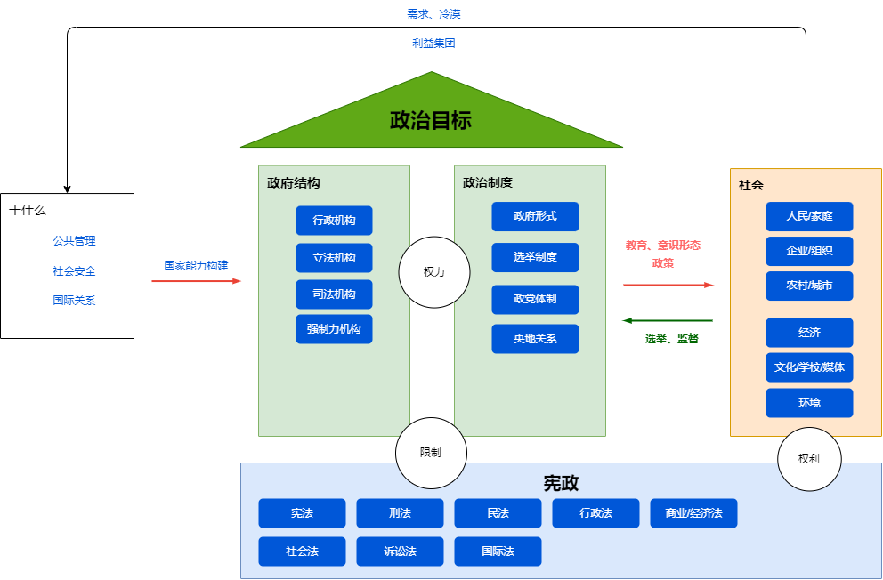

[Johan Skytte Prize in Political Science](https://en.wikipedia.org/wiki/Johan_Skytte_Prize_in_Political_Science)

# 政治科学

# 中国政治

[当代中国政府与政治：景跃进](https://book.douban.com/subject/36939802/)  

[中国国家治理的制度逻辑 : 一个组织学研究](https://book.douban.com/subject/26901114/)

