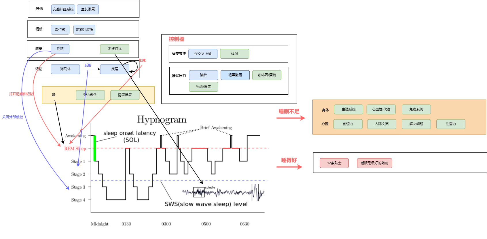
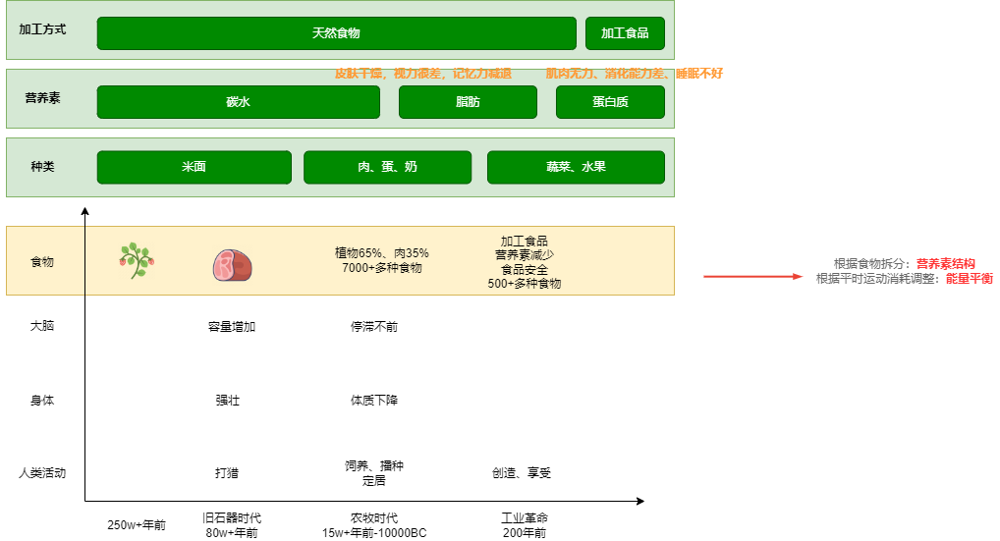
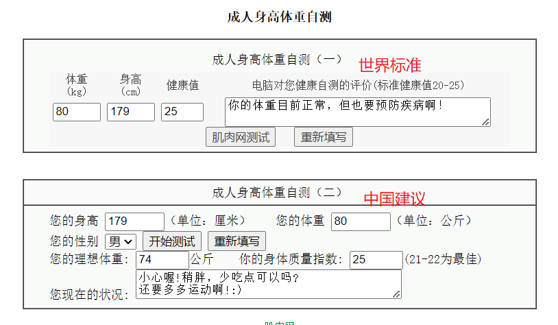
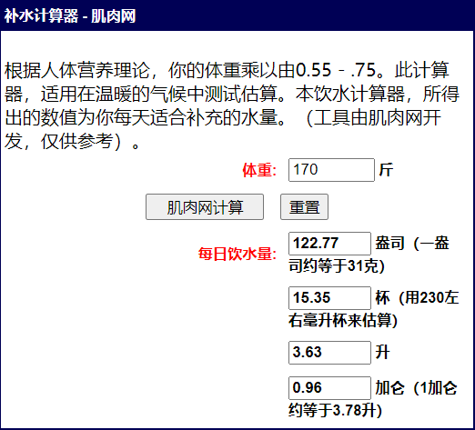

[Healthy Living Guide 2020/2021, Harvard T.H.CHAN](https://www.hsph.harvard.edu/nutritionsource/2021/01/19/healthy-living-guide-2020-2021/)

[程序员延寿指南](https://github.com/geekan/HowToLiveLonger)  
收集所有已证明，显著影响ACM的活动。（具有实际意义）    

[程序员防猝死指南](https://www.cnblogs.com/anding/p/16482341.html)  
主要是围绕健身周围的一系列知识和实用的活动指南。  

# 睡眠

[美国国家睡眠基金会](https://www.sleepfoundation.org/)

[Improving Sleep: A guide to a good night's rest, harvard](https://books.google.com/books?id=G8lL1ZhvZjIC&printsec=frontcover&hl=zh-CN&source=gbs_ge_summary_r&cad=0#v=onepage&q&f=false)

[YOUR GUIDE TO Healthy Sleep, nih](https://www.nhlbi.nih.gov/files/docs/public/sleep/healthy_sleep.pdf)

[Sleep resources guidebook](http://www.promoinfotools.com/Communications/ecard/Svcs/BetterSleep/SleepGuidebook_RFL.pdf)

[Nathaniel Kleitman, PhD, Kleitman99](https://www.uchicagomedicine.org/forefront/news/nathaniel-kleitman-phd-1895-1999)

Kleitman在猛犸洞里证明了一项惊人的科学发现，人类的昼夜节律大约是一天。  

[Physiology of Sleep, carley2016](https://www.ncbi.nlm.nih.gov/pmc/articles/PMC4755451/)

[我们为什么要睡觉？](https://book.douban.com/subject/35332778/)

超过65%的美国成年人在一周中没有一天晚上得到了7~9小时的建议睡眠时间。  
人类（以及所有其他物种）永远不能把我们之前失去的睡眠“睡回来”。 

一生的睡觉时间

| 阶段  | 睡觉时间  |时长|备注|
|---|---|---|---|
|出生前   |   |24, 6REM+6NREM+12|肌肉抑制系统不健全|
|幼儿   |   |11小时|逐渐双相睡眠，NREM:REM=80:20|
|9岁   |8pm入睡，9pm睡着   |10小时, 9-12||
|16岁   |11pm入睡  |9小时, 8-10 |节律器比父母晚|
|成年人   |10pm  |8小时, 7+ |
|中老年人   |8pm |8小时 |慢波质量和数量降低，记忆衰退，频繁清醒，节律器提前，但腺苷压力不足

# 饮食

每日营养

| 营养  | 摄入量  |推荐|美国标准|中国标准|我|国内平均
|---|---|---|---|---|---|---|
|蛋白   | 5个鸡蛋=2斤牛奶=2两鸡肉=2个鸡腿  |廋肉1两+鱼1两+1两大豆+半斤牛奶+1个鸡蛋 |56g|70g|1个鸡腿+1个鸡蛋|65g
|碳水   | 100g土豆=100g红薯=15g碳水  |不能一味追求低GI  |130g|400-600g|（50g土豆+100g红薯）/餐|300g
|脂肪   | 鱼+坚果+鸡蛋  |不能一味追求低GI  |50g|70g||80g
|   |   |  |||150g西兰花/餐||
|   |   |  |||1个苹果+半个橙子||

[中国居民膳食指南](http://dg.cnsoc.org/article/04/x8zaxCk7QQ2wXw9UnNXJ_A.html)

【强调蔬菜+奶制品】> （水果+谷类） > 动物 > （薯+豆）  
建议(1个鸡蛋+200g牛奶)+（150g廋肉+1小团蔬菜+1小团碳水）+（1小团谷薯+1小团蔬菜+1个苹果）

[你是你吃出来的](https://book.douban.com/subject/27590675/)

比如血管的内皮细胞1天就会死亡；胃黏膜细胞3～5天更替一次；肺表面的细胞寿命是2～3周；皮肤最外面的角质层细胞28天左右就要换新；肝细胞能存活150天左右；心脏细胞更新速度要慢很多，大约需要20年；

我们最常见的冠心病、高血压、糖尿病、肿瘤、抑郁症、气管炎、哮喘、慢性肾病等疾病，都是由不恰当的生活方式引起的，医学工作者将这些疾病统一归类为慢性非传染性疾病，简称**慢病**。

追根究底，慢病源于各种不平衡，比如缺乏睡眠、长期吸烟、大量饮酒、不运动或者运动过量、饮食不平衡、压力太大，等等

满分早餐=2个鸡蛋+200牛奶+蔬菜水果（包子+鸡蛋+果蔬汁）

[健身营养全书](https://book.douban.com/subject/30157798/)  

每天有200g的蛋白质被转化。 
中低强度的耐力训练消耗更多的脂肪酸供能。  
各国营养学会基本上都推荐50-10-30（碳水-蛋白质-脂肪）的饮食结构。 

## 基础代谢

https://www.jirou.com/tool/reliang.php

| 营养  |标准   |当前
|---|---|---|
| 体重  | 179-105=74kg  |80
| 能量  | 轻体力74*30=2220大卡  |2890
| 碳水  | 55%*2220/4=305  |102
| 蛋白质  | 15%*2220/4=83.25 |50
| 脂肪  | 2220*20%/9=50|33

早餐：豆浆+鸡蛋（68+66=134卡）  
午/晚餐：土豆100g+西兰花150g+1个鸡腿（69+40+120=229卡）

input=872卡/天+1个苹果（80卡）+牛奶130=1050卡

output=250步行+100健身+1865基础=2215卡

## 饮水

# 运动、健康
> 吃的健康、有规律的锻炼、维持体重、限制酒精、不抽烟

[运动生理学，wilmore11](https://book.douban.com/subject/7058979/)

[量化健身：原理解析, 陈柏龄2019](https://book.douban.com/subject/34912103/)  

体重=骨骼+水分+肌肉+脂肪  

人体供能顺序：糖类->脂肪->蛋白质  

| 目标  | 合成原理 | 代谢本质 | 训练方式|
|---|---|---|---|
|脂肪   | 食物脂肪+碳水化合物+蛋白质 |热量赤字+持续，提高肾上腺素、降低胰岛素，控制分解速度    |训练强度低、容量较高、组间休息时间短。力量+有氧运动。  
|肌肉   |肌肉围度增大包括慢肌（纤维加粗的健美型）和快肌（纤维增多的力量型）。|运动前后热量盈余+蛋白+训练压力    |阻力对抗训练->肌肉肥大，4~6组，高强度，三分钟间歇。|
  
> 先力量训练（自由核心训练+固定器械）、再做有氧训练（跑步）。  
> 地中海式饮食=高质量低脂+灵活大体积碳水  

