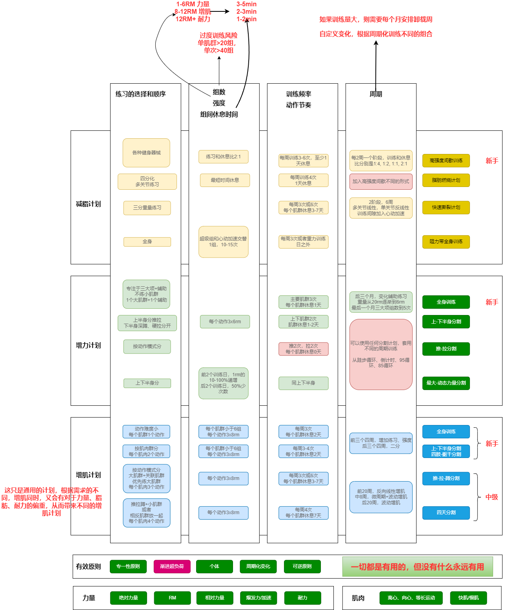

# 健康体魄
> 吃的健康、有规律的锻炼、维持体重、限制酒精、不抽烟
> 
> 体育健身活动可以提高人体的心肺功能、肌肉力量、柔韧、平衡和反应能力，改善身体成分，从而达到增强体质、提高健康水平的效果。

[体育强国建设纲要](https://www.gov.cn/xinwen/2019-09/02/content_5426540.htm)

[全民健身指南](https://www.sport.gov.cn/n315/n20067006/c20324479/content.html)  
综合运动能力评价 = 心肺功能40+BMI20+肌肉力量20+柔韧性10+平衡能力5+反应能力5

中等运动强度主要包括健身走、慢跑（6～8千米/小时）、骑自行车(12～16千米/小时)、登山、爬楼梯、游泳等

力量练习包括非器械力量练习和器械力量练习。非器械练习是指克服自身阻力的力量练习，包括俯卧撑、原地纵跳、仰卧起坐等；

[美国体育活动指南](https://health.gov/sites/default/files/2019-09/Physical_Activity_Guidelines_2nd_edition.pdf)  
提升健康、降低慢性病风险和提升健康相关体适能（而不是运动相关）是本指南的重点。  
几乎80%的美国成年人没有满足有氧和增肌活动关键指南，只有一半的人满足有氧活动。  
NHANES发现孩子和成年美国人有7.7个小时是久坐的。  

体适能定义是身体有足够的精力和体力进行日常事务, 而不会有过度疲倦, 并且有足够的精力享受休闲活动和应付突发事件的能力。  
体适能=心肺+骨骼肌机能+灵活性+平衡+速度。  

只要是运动了就会有健康好处。越高的运动级别，越能降低全因死亡率。有些运动，立马就可以获得好处，比如降低焦虑，血压，改善睡眠、认知功能和胰岛素灵敏度；而增加心肺健康、肌肉强度、降低抑郁症状、维持血压降低，则需要几周、几个月的运动。  

|年龄  | 体育运动  |
|---|---|
|6-17岁   |  每天要有氧运动1个小时，每周3次增肌活动。   |
|成年人   | 少坐多动，每周有氧2.5-5个小时，每周2次增肌活动。8-12次，2-3组   |
|65以上老年人   | 同上；尽可能多个不同组件结合；特别是平衡运动   |

[Lean in 15](https://www.amazon.com/Lean-15-15-Minute-Workouts-Healthy/dp/0062493663)  
作者鼓励多吃，合适的燃烧脂肪，构建更多精瘦的肌肉，从而基础代谢更有效，然后你能够愉快的吃更多的食物了。  
严格的饮食和训练计划，与美食、在家烹饪、外出享受的平衡  
**愉悦的、可持续的、批量现成的、快速的、健康营养的、在家烹饪**  
瘦身没有捷径，必须符合基本的营养和代谢原理，节食、燃脂草药、奶昔果汁代餐都不是解决方案  
**使我们发胖，是因为吃得过多，超过我们身体所需，而不是碳水本身**  
黄油和椰子油等饱和脂肪用来高温炒菜，而不是加工过的多不饱和植物油  
真实的食物、水合作用、HIIT，脂肪燃烧

训练日吃2顿低碳+1顿训练后碳水加油餐+上下午零食，休息日3顿都只能吃低碳餐+上下午零食  
健身后，加1次补充餐（蜂蜜+蛋白粉），快速抵达重建肌肉纤维  
每周有氧和抗阻HIIT交替2次+额外1次，每周增加0.3m/h跑步机，2斤哑铃

[更壮 更瘦 更强](https://book.douban.com/subject/27107200/)  
增肌=逐步增加重量，正确饮食，让身体得到充分的休息。  
减脂=消耗>摄入+有氧+少吃多餐  

当然，内心的游戏是训练和饮食的精神方面，这是真正将伟大的体格与平庸区分开来的地方。建立一个杀手般的体格并不是跟随一些新的流行的锻炼计划几个月的问题，而是采取一种有纪律的、有序的方法来处理你的身体，这对大多数人来说是一种生活方式的改变。

现在，人们在这个世界上最大的心理障碍是缺乏动力和缺乏自律。他们通常一开始充满决心和意图，但在短短几周内，他们的奉献精神就动摇了。那个新的电视节目在健身时间开始。多睡一小时真是恰到好处。放几天假没什么大不了的。再吃一顿欺骗餐应该不会有太大的伤害。

[肌肉与力量，Stoppani](https://book.douban.com/subject/27128869/)  
[量化健身：原理解析, 陈柏龄2019](https://book.douban.com/subject/34912103/)  

这2套书，讲的东西比较类似，stoppani侧重全面的概念、策略、计划、动作。量化健身侧重实际，重点和细节，超量恢复的策略。  

如果长时间经受相同的刺激，身体就会进入疲劳阶段，对刺激的适应能力可能会下降。需要采用新的训练方式，使进步持续下去。**每种方法都有效，但每种方法都不可能永远有效。**

卧推、深蹲、硬拉的均衡力量比为1:1.5:1.5

更多的次数，在训练中消耗的热量更多；更大的重量，在训练后和休息中消耗的热量更多。更重要的是你在一天中消耗的热量和燃烧的脂肪的总量。    

如果你的目标是最大限度地增肌，**那么最重要的原则就是通过完成训练中的所有组数使肌肉达到力竭**。因此训练中，需要加入重大次少和重小次多变化。  

但是为了获得最佳增肌效果，使用多大的训练量,或者说怎样设定总组数才最理想还存在争议，现在还没有一个用于增肌的理想的训练组数。

[运动生理学，wilmore11](https://book.douban.com/subject/7058979/)

## 供能系统、力量、肌肉与人体

[人體三大能量系統](https://www.chachanuts.com.tw/article_detail/45)  

目前用於確定運動時是由哪個能量系統來供應能量的最有效方法之一，就是監測運動時的心率。心率監測可以幫助你確定訓練的強度，並估算是運用到哪一個能量系統。一般我們會以最大心率作為參考，再根據當下心跳速率為最大心率的多少使用比例，來估算能量供給區間。

[肌肉纤维的类型](http://www.hkpe.net/hkdsepe/human_body/muscle_fiber_types.htm)

早期胎兒的驅幹及四肢主要是由元始並且未曾分化的 Type IIC 肌纖維組成，稍後才逐漸分化成組織學上可辨認的 Type I，IIA 及 IIB 類別（Vogler 與 Bove，1985）。在正常情況下，肌纖維會於 12至 15歲時生長到成年人應有的大小。

在成年人的肌肉內，不同類形肌纖維的比例有很大的差異。  

[糖原](https://zh.wikipedia.org/wiki/%E7%B3%96%E5%8E%9F)  
在肝脏细胞（肝细胞），糖原可以在饭后不久构成[3]。只有储存在肝脏的糖原可以由其他器官使用。在肌肉，糖原的浓度较低（约肌肉质量的1-2％）。

人体内糖原总量约200-500克，相当于800-2000大卡热量。若不从外界摄入能量，人体内糖原会在18小时内耗尽。

[Muscle hypertrophy and muscle strength: dependent or independent variables? A provocative review](https://www.ncbi.nlm.nih.gov/pmc/articles/PMC7582410/)

Maximizing Muscle Hypertrophy: A Systematic Review of Advanced Resistance Training Techniques and Methods

[Why exercise builds muscles: titin mechanosensing controls skeletal muscle growth under load](https://www.sciencedirect.com/science/article/pii/S0006349521006093) 

[更壮 更瘦 更强](https://book.douban.com/subject/27107200/)  
通过举重，你实际上在肌肉纤维中造成了微小的撕裂(被称为“微撕裂”)，然后身体会修复这些撕裂，使肌肉更好地处理造成损伤的刺激。这就是肌肉生长的过程(科学上称为肥厚)。

|   | 膳食  |调整|
|---|---|---|
|最大化增肌   | 1g/lb蛋白质+2g/lb碳水+1g/3lb脂肪  |然后根据自己的精力程度进行10-15%的调整，控制总共的热量摄入。
|最大化减脂   | 1.2g/lb蛋白质+1g/lb碳水+1g/5lb脂肪  |1lb脂肪=3500大卡=7*500大卡缺口。通过观察自己的体重、衣服适配度、镜子感观、精力、力量、睡眠。减脂的时候，基础代谢会下降，皮质醇在体内更久，睾丸激素减少，肌肉中的糖原减少。

总体来说本书是提供一个**重力量，轻组数**的训练策略。每天训练1-2肌肉群，每个肌肉群做6-9工作组（不包括热身组），每组4-6次，每次提留5秒（2-1-2），80-85% 1RM，组间休息2-3分钟，总共45-60分钟。每5-7天重复同一肌肉群。8-10周休息一周。  
热身组，休息1分钟，10个同样重量，休息1分钟

|   |   |
|---|---|
| 热身1组  | 12个1/2最大，休息1分钟  |
| 热身2组  | 10个1/2最大，休息1分钟  |
| 热身3组  | 4个70%最大，休息1分钟  |
| 热身4组  | 1个90%最大，休息2-3分钟  |
| 第5-7组  | 最大  |

有氧运动与力量训练要间隔至少2-3小时。

d1=胸+肱三头肌、d2=背+肱二头肌、d3=腿+肩

d1=胸+腹肌、d2=背、休息1天、d3=大腿+小腿、d4=肩、d5=手臂+腹肌、休息2天

## 组数、强度、频率

[Progressive overload](https://en.wikipedia.org/wiki/Progressive_overload)

[How to Gain Muscle, No Matter Who You Are](https://www.healthline.com/health/fitness/how-to-gain-muscle#training-tips)  
使用不同的训练强度会产生不同的训练效果

[居家健身不能少了运动处方](https://www.sport.gov.cn/n20001280/n20001265/n20066978/c24905714/content.html)  
**运动中最佳心率**：110至130次，低于此心率范围不能达到锻炼目的，高于此范围则有可能诱发意外情况发生或者给身体造成损伤。

**运动频率**： 每周3次，每次运动时间为50分钟。

运动阶段分为热身运动、逐渐加量、整理恢复三部分：

热身运动可以慢走、拉伸、活动各个关节，此时身体开始出汗，身体的运动兴奋性提高，时间为5分钟。

逐渐加量需要进行40分钟运动，该阶段逐步增加运动强度达到最佳心率范围，持续30分钟。

整理恢复时，四肢进行韧带拉伸伴深呼吸，恢复至平静状态，时间为5分钟。

[How To Build Muscle, According To Experts](https://www.forbes.com/health/fitness/how-to-build-muscle/)  
首先，要记住引发肥大的三个主要因素:机械张力、肌肉损伤和代谢反应。  

**评估你的1RM重量**。完成多组（新手2-3组），每组6-12次，每次65%-85% 1RM，组间休息<60秒，最大限度提升睾酮和生长激素。

**重新调整训练容量**。随着肌肉能力的增强，同样的阻力无法带来更多的肌肉组织破坏，个把月要重新评估1RM重量。  

补充蛋白质1.2-2.0g/kg。

[How To Set Up A 7-Day Workout Schedule, According to Experts](https://www.forbes.com/health/fitness/workout-schedule/)  
在适度的运动中，你应该感觉自己在工作，但可以很好地呼吸，自由地说话。他说，剧烈运动使你的呼吸达到一次只能咕哝几句话的程度。  

为了增加肌肉大小和力量，最多做6-8次；为了增加耐力，增加到12-25次。做2-4组。

根据自身不同目标，选择各种不同的训练内容交替进行。比如周一、四=有氧运动、周二、五=阻力、周三、六=平衡和灵活、周日=拉伸和慢走。 

[健身房重訓新手怎麼開始？](https://sport.heho.com.tw/archives/4802)  
重訓屬於強度高的運動，它不像有氧運動一樣可以持續做，每個組(回)數之間需要休息，才不會使肌肉使用過度而受傷。強度越高每組之間休息的秒數也要越長，ㄧ般來說輕阻力(輕重量)可做12下以上，休息時間為30-60秒 ; 中阻力可做8-12下，休息時間為60-90秒 ; 高阻力(大重量)只能做8下以下，休息時間為兩分鐘左右。

首先將訓練依部位拆為上半身(胸部、肩部、背部、手部)與下半身(核心、腿部、臀部)。建議每個動作做8-12下，做3-5回(組)，每回之間休息30-90秒。每週輪兩次，其中ㄧ次可做重量輕且動作次數多(15下)。從大肌群開始做(大腿肌、背肌)，核心腹部放中後段練。

周一、四=上半身，周二、五=下半身，周三、六、日=伸展或者休息

## 周期、训练计划

[第三章 周期化训练，肌肉与力量，Stoppani](https://book.douban.com/subject/27128869/)  
如果长时间经受相同的刺激，身体就会进入疲劳阶段，对刺激的适应能力可能会下降。需要采用新的训练方式，使进步持续下去。**每种方法都有效，但每种方法都不可能永远有效。**

[增肌训练的周期化训练专题2：线性化训练周期](https://zhuanlan.zhihu.com/p/619536917)  

## 举重、哑铃、器械、自由锻炼

https://hacker1356.wordpress.com/2020/12/27/%E5%B8%B8%E7%94%A8%E5%81%A5%E8%BA%AB%E8%82%8C%E8%82%89%E8%A7%A3%E5%89%96/

### 逃杠、安全

[卧推被压？四种逃杠技术在这里](https://zhuanlan.zhihu.com/p/43981573)

[深蹲致死！一定要学会如何逃杠！CrossFit Vlog](https://www.bilibili.com/video/BV12m4y1L7Wi)

### 深层肌肉、核心收紧、骨骼运动

[屈髋](https://zhuanlan.zhihu.com/p/29587961)  
很多人不会动用髋关节，总是用“弯腰”来代替“屈髋”，腰椎承力能力显然不如髋，所以日常搬运重物时就有伤腰的风险。同理，很多人下肢运动时只会蹬膝，时间久了膝盖就受伤了。

屈髋这个动作，只有髋关节有一个很大的折角，屈髋全程要保证上半身，尤其是腰背都是平直绷紧的状态。下半身小腿不动，大腿会向后走一点，导致膝关节处有一点角度变化。因为当你的髋角有个大的变化之后，上身前倾，为了重心稳定，防止向前倒下去，屁股必须往后走来平衡重心，所以会有一点屈膝。但我们要知道主要动的关节是髋，而不是膝。

[【骨盆眨眼】终极解决方案](https://www.bilibili.com/video/BV1BM4y1H7bU/?spm_id_from=333.337.search-card.all.click&vd_source=d62bfd78dd962a5ca21e880c1f120e5a)  

[健身这么久你会收紧肩胛骨吗？到底是啥玩意？](https://www.sohu.com/a/546437783_121373052)  
肩带关节可以做上提和下降（耸肩和沉肩）、前引和后缩（含胸和扩胸）、上回旋和下回旋（转肩）等各个方向的运动。肩带关节的这些运动主要就是由肩胛骨来体现的。

要收紧肩胛骨，需要同时做沉肩和挺胸的动作。在运动解剖学里，沉肩也叫肩胛骨下降，主要是由斜方肌下束收缩完成。

挺胸也叫肩胛骨后缩，主要是由两块肩胛骨之间的菱形肌和斜方肌中束共同收缩来完成。

[前锯肌训练详解](https://www.bilibili.com/video/BV1Vx42127ZE)  

[肩袖肌群训练详解](https://www.bilibili.com/video/BV1yW421A7rn)

### 上半身

[【动作】：你可能练了很久臂屈伸，但是未必做对了！](https://zhuanlan.zhihu.com/p/116074434)

[如何做一个标准的俯卧撑](https://www.westridgeperformance.com/strength-training/6145381)

|   |   |    |
|---|---|---|
| 臂屈伸  | ，|
| 哑铃胸推| |
| 划船  | , |
| 肱三头肌支撑  | |

#### 胸部

| |   |    |
|---|---|---|
| 蝴蝶飞鸟  | |中胸
| 杠铃卧推  ||中胸
| 上斜哑铃卧推| |上胸
| 交叉夹胸  | |上述中间交叉
| 俯卧撑  | |

#### 背部

| |   |    |
|---|---|---|
| 硬拉  | ，|
| 引体向上| ，|反手练背阔肌，正手练大圆肌, 也可以做手臂直立激活
| 划船/T杆  | , , |速度更重要
|窄/宽手下拉, 坐姿平拉|, , |
| hyper y/w/山羊挺  | , |竖脊肌和臀部肌肉

#### 肩部
 

[完美肩部训练计划](https://www.bilibili.com/video/BV1pb411q7Mv?p=4&vd_source=d62bfd78dd962a5ca21e880c1f120e5a)  
充分热身，避免受伤。  
在正式训练的间隙，安排中间组肩膀的拉伸。按照后/中/前的顺序。  
要练爆发力的话，多肌群发力，可以上借力侧平举和单侧过肩举。  

[【练肩的细节和容易出现的问题】第三视角私教课](https://www.bilibili.com/video/BV1RX4y1j7P6/?spm_id_from=333.337.search-card.all.click&vd_source=d62bfd78dd962a5ca21e880c1f120e5a)  
顶峰收缩。  
离心控制。  
肌肉募集感。

热身激活:  
单侧前锯肌2*15(用力送肩，有酸胀感)  
双手前锯肌1*10  
杠铃片绕肩2*20(不要太重，避免代偿)  

|   |  |    |
|---|---|---|
| 过头推举/哑铃推举  | ，|小臂垂直，肘部内收
| 拉力器三角拉伸  | , , |保持肘关节刚性，3组21响，中、后、前
| 借力侧平举| ,|
|坐姿反向飞鸟| |
|面拉| |慢做

#### 手臂

前臂

|  |   |    |
|---|---|---|
| 二头弯举  | |
| 上斜哑铃弯举| |
| 绳索下压超级组  | |
| 弹力带哑铃碎颅式  | |
| 垂式彎舉  | |
| 哑铃农夫行走  | |

### 臀腿

|  |   |    |
|---|---|---|
| 深蹲练习  | |
| 坐姿推腿  | |
| 弯腿  | , |
| 小腿弯举  | |
| 杠铃臀推  | |
| 弓箭步  | |各种变体，训练臀肌、股四头肌

### 腹部

[【2023】腹肌訓練全攻略：5大秘訣提升腹肌感受度！男女通用３大腹部訓練動作](https://physicfit.com/abs-training-2/)

|   |   |    |
|---|---|---|
| 平板支撑| 3组30s, , , :upscale()/2014/04/25/733/n/1922729/e43864e566adffe4_side_elbow_plank.jpg)|
| 大锤摇摆  | |
| 登山  |3组1min， , , |
| 卷腹  | ,， |

### 有氧、灵活、平衡、耐力
|   |   |    |
|---|---|---|
| 跑步、徒步、骑行、瑜伽、快走 | 30mins|, 
| 开合跳  |3组1min|
| 高抬腿  |3组1min|
| 波比跳  |3组30s|

## 运动伤痛预防、治疗、康复

[硬拉、卧推时手肘疼痛，你可能患网球肘或高尔夫球肘，怎么破解？](https://www.sohu.com/a/389358998_120562864)  
引起网球肘和高尔夫球肘主要原因：重复性工作、上肢运动过多、强力刺激等。

网球肘和高尔夫球肘最佳的纠正训练是将肌肉的柔韧性训练到最好，以此来降低肌肉对爆发力和稳定能力的限制，必须强化伸屈肌群的离心功能，从而使其对肘和腕有良好的稳定作用，减少肌腱的压力。

[【体态康复系列②】骨盆前倾的自我筛查与解决方案！！！！](https://www.bilibili.com/video/BV1nv4y177sQ)  

[【体态康复系列③】腰椎间盘突出了！自懂自救](https://www.bilibili.com/video/BV1kh411G7Li)  

