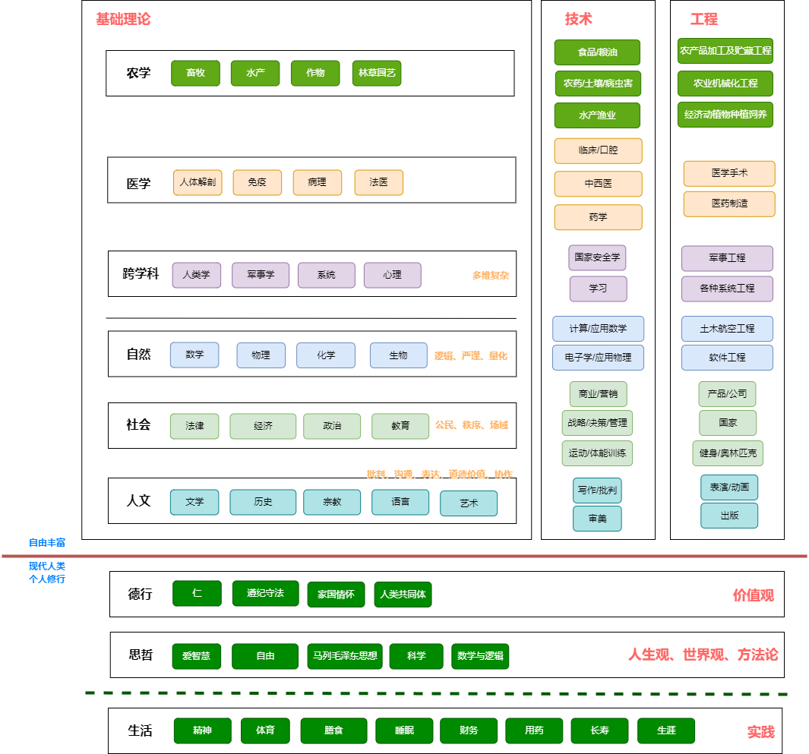

[国务院关于印发全民科学素质行动规划纲要（2021—2035年）的通知](https://www.gov.cn/zhengce/content/2021-06/25/content_5620813.htm)

[1959年，他发表著名的“两种文化”演讲 | 历史](http://zhishifenzi.com/depth/thought/2405.html)   
文学家觉得科学家是肤浅的乐观主义者，对文化不了解，而科学家又会觉得文学家的想法太厌世，是病态的，甚至这种厌世和病态是奥斯维辛集中营背后的原因之一。斯诺为两方分别进行了开脱，当然在开脱之余，斯诺批评了整个文学界对于科学的无知，同时也批评了科学家把书仅当作工具，以及对工程的轻视。不管是科学家没读过莎士比亚，还是文学家不懂热力学第二定律，在斯诺的眼里这都是不对的。最后，斯诺将矛头指向了英国的教育系统，认为这一体系过于强调专业化。

新学科的发展，尤其是脑科学（比如，记忆、学习、同理心、情绪等机制）作为桥梁，已拉近了科学（生物、化学）与人文（心理现象）的距离。值得注意的是，在经济转型时期，国家强调科技创新，也许科技能够得到足够的重视，而人文反倒可能被忽视。

面对科技飞速发展带来生活方式的异化，人文可以帮助我们寻找到生活的本质和意义，从这个角度来讲，卢德派的主张倒不失为一个提醒；另一方面，科技的进步，的确如斯诺所言，帮助了穷人提高了生活水平，但却没能解决贫困问题。科技只是提供了可能，但是否一定适用，仍因人而异，与文化密切相关。应用科技来解决贫困问题，其实是个科学之外的问题，这也是斯诺呼吁的科学和人文应更加紧密结合的原因所在。

[从文化视角看科学素养](http://www.xml-data.org/KXYSH/html/87c186b4-6b12-4fd2-ace9-56e2f603de2c.htm)  
科学文化是科学家的创造性活动、成果及凝聚在其中的思想、观念、精神和传统，是在科学与人类其他亚文化系统互动中形成的人类生活方式，并且是一个不断发展的过程。

根据科学文化的第一种意义，科学文化首先是科学家的创造性活动及其成果。因此，对于学习和理解科学来说，理解科学问题、科学发现的背景，理解科学方法和科学发现过程，显然都至关重要，当今我国的科学教育或理科教育则更为侧重知识传授而明显忽视背景、方法和过程，这种倾向不仅偏离科学教育的本质，也对应试教育起了推波助澜的作用。

[Ontology and Epistemology](https://www.webpages.uidaho.edu/engl257/classical/ontology_and_epistemology.htm)

# 知识分类、学科分类
[学科分类与代码:大学科学专业分类图谱|文科/理科/工科|知识](https://www.zhoulujun.cn/html/res/scienceTechnology/Encyclopaedia/8158.html)

[国务院学位委员会第八届学科评议组成员名单](https://ks3-cn-beijing.ksyun.com/attachment/ba328e102c7d46ef27d7c6369b040ec1)  
2020年各学科领军人物。  

[中国科学院大学一级学科学位授予标准](http://www.fjirsm.cas.cn/yjsjy/xwgl/gzzd/202301/W020230116633802644699.pdf)  
每个学科都有介绍和学位标准。  

[中外学科划分情况比较研究](https://ciefr.pku.edu.cn/cbw/kyjb/a8b669e298a54f23971b06b04550d1a5.htm)

[作为“大科学”的人文科学](http://www.aisixiang.com/data/101540.html)  
[马克思主义如何理解“科学”](https://www.jsthinktank.com/zhikuyanjiu/202302/t20230222_7838221.shtml)  
[自然科学、社会科学和人文学科的内涵和外延](https://www.jianshu.com/p/1df84ea6f751)  
人文科学主要研究人本身或与个体精神直接相关的信仰、情感、心态、理想、道德、审美、意义、价值等。  
社会科学以社会作为研究对象，研究人的行为，其目标在于认识各种社会现象并尽可能找出它们的之间的关联。  
自然科学是实验科学或日经验科学，也就是说它是基于经验的。  

[钱学森思维科学思想](https://book.douban.com/subject/10617446/)  

钱老通过运用马哲理论，把科学与马哲进行关联、分类、分层。  
通过结合现代人类和自身的经历，我再联系下现代人类个人修行，把人的生活、三观，自由丰富的人生联系起来。  

# 科学
[论科学 、技术与工程之间的关系, 2006](http://www.cnki.com.cn/Article/CJFDTOTAL-KXBZ200603005.htm)

[世界观, DeWitt2010](https://book.douban.com/subject/30379527/)  
世界观=核心观点+外围观点。  
由于知觉表征无法确定现实真正的样子，再加上事实可以与当时的整体观点体系拼合在一起，于是想要澄清问题，提供的证据和常识并不是那么的显而易见。  
现代科学并不能保证所有的理论都是正确的，而是提供可能正确的理论。  
经典的亚里斯多德公理化方法=第一原则+三段论。人们普遍认为科学知识必须为真。  
波普的证伪主义=证实证据太难+反复经历明确的预言推敲。  
工具主义=科学理论的主要任务是解释和预言相关数据，而是否反映事物的真实情况不重要。  

[大师说科学与哲学](https://book.douban.com/subject/27041829/)

[具体数学](https://book.douban.com/subject/21323941/)

[哥德尔、艾舍尔、巴赫](https://book.douban.com/subject/1291204/)

[The Principia: Mathematical Principles of Natural Philosophy, isaac1687](https://book.douban.com/subject/1507315/)

https://ocw.mit.edu/courses/science-technology-and-society/sts-003-the-rise-of-modern-science-fall-2010/syllabus/
https://ocw.mit.edu/courses/science-technology-and-society/sts-310-history-of-science-fall-2015/syllabus/
https://books.google.lk/books?id=t4qX37A4PVwC&printsec=frontcover&source=gbs_ge_summary_r&cad=0#v=onepage&q&f=false
https://en.wikipedia.org/wiki/History_of_science
https://en.wikipedia.org/wiki/Branches_of_science

# 公民科学素质
[14.14%！第十三次中国公民科学素质抽样调查结果公布](https://tech.gmw.cn/2024-04/16/content_37266781.htm)  

本次调查覆盖全国（不包含港、澳、台）31个省（区、市）和新疆生产建设兵团、333个地市级行政单位和86个直辖市所辖区县，调查对象为18~69周岁公民（不含现役军人），采用线下入户面访（计算机辅助面访系统）与线上手机短信推送（计算机辅助网络访问系统）相结合的调查方式。本次调查设计线上线下样本达30.0万份，由中国科普研究所会同社情民意调查中心及第三方专业质控团队，认真谋划、精心组织、严格执行、严控质量、精细计算，经过各方不懈努力，共计回收有效样本28.9万份，达到设计要求。

按城乡、地区、性别、年龄、文化程度、获取科技渠道、基础设施利用、公众对科技发展的态度等维度进行统计。

[科技部　中宣部关于印发《中国公民科学素质基准》的通知](https://www.gov.cn/gongbao/content/2016/content_5103155.htm)

[中国公民需要什么样的科学素质基准](http://www.qunzh.com/ldjs_2612/whjs/201604/t20160429_68241.html)  
其实在做调查之前，首先应当弄清楚科学素质是什么。李大光告诉记者，这个问题曾在欧美等国家有过长达50年的讨论，到上世纪80年代中期，有价值的相关论文达到300多篇。学者们比较一致地认为，科学素质调查要从自己国家的性质和所处的发展阶段出发，设计出适合测度本国科学素质的测试题。

[《中国公民科学素质基准》的历史与思考](https://blog.sciencenet.cn/blog-797254-972347.html)  
详细的讲了基准的初稿、测试到正式版的经过。

就提高公民的科学素质而言，我觉得应该把重心放在中小学科学教育上，提高中小学科学教育质量，培养具备科学素质的中小学生，也就是培养具备科学素质的未来公民。成年人的科学素质提高工作也要做，不过很难，怎么做也是值得社会各界考虑的。

[八位学者齐发声：对《中国公民科学素质基准》中一些问题的意见](http://zhishifenzi.com/news/multiple/3252.html)

[四十载砥砺前行 新时代再书华章-科学的春天 40年科普事业回顾与展望](https://bulletinofcas.researchcommons.org/cgi/viewcontent.cgi?article=1459&context=journal)

[project2061](https://www.aaas.org/programs/project-2061)  

[Mission 2061: The Story of Science Reformer, F. James Rutherford](https://web.archive.org/web/20110720173923/http://www.ihpst2005.leeds.ac.uk/papers/Lange.pdf)

[科学学035－《普及科学：美国2061计划》项目中的科学观解析](https://blog.sciencenet.cn/blog-523135-413004.html)

[美国的“公民科学素质基准”是怎么产生的？](http://zhishifenzi.com/depth/depth/2647.html)

[米勒体系的结构演变及其理念解析, 2010](https://www.crsp.org.cn/cms_files/filemanager/zgkps/uploads/soft/150215/1-150215114522.pdf)

# 从科学素质到学科核心素养

# 哲学

[想透彻, 阿皮亚2017](https://book.douban.com/subject/27167590/)

[大问题, 所罗门2018](https://book.douban.com/subject/30176572/)