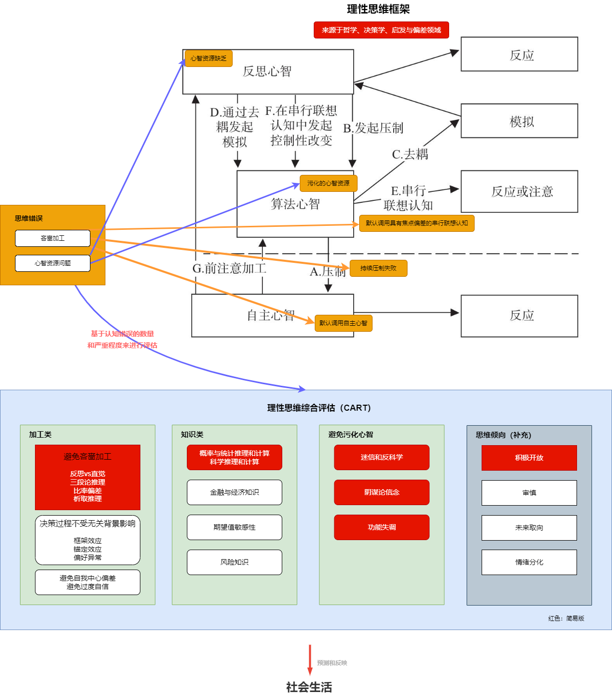

[Nobel02, Kahneman](https://www.nobelprize.org/prizes/economic-sciences/2002/kahneman/facts/)

[mind, thagard05](https://book.douban.com/subject/1869660/)

[Cognition, Brain, & Consciousness, Baars2010](https://book.douban.com/subject/26715572/)  

[what happened to coginitive science, rafael2019](https://www.nature.com/articles/s41562-019-0626-2)

https://plato.stanford.edu/entries/cognitive-science/  
https://www.cs.colorado.edu/~mozer/Teaching/syllabi/3702/  
http://www.cogsci.rpi.edu/public_html/heuveb/teaching/CogSci/Web/Schedule.htm  
https://www.seas.upenn.edu/~cis140/schedule.html  
http://perception.yale.edu/Brian/courses/IntroCogSci-Syllabus.pdf  
http://mechanism.ucsd.edu/teaching/w07/philpsych/bechtel.cogscihistory.pdf  

https://www.open.edu/openlearn/ocw/mod/oucontent/view.php?id=20033&section=1.1

意识？潜意识？理性？感性？

# 决策力

> 选择过多，决策力下降
>
> 比萨和中餐效应
>
> 我们自身的智慧通过情感（精神）和直觉（身体的本能反应）发挥作用

# 思考、推理、解决问题

[Mindware: A Theory of Learnable Intelligence](https://nesslabs.com/mindware)

[超越智商, Stanovich2010](https://book.douban.com/subject/26605978/)  
[理商, Stanovich2016](https://book.douban.com/subject/35083569/)  

本系列书偏学术理论，不太适合科普，但终于把**理商**拉到了独立可测试性的高度。  
对于人们的生活来说，没有什么东西比能够找到“真”和“佳”的思维更实际和更有用的了。  
正是由于流体智力（算法心智）的个体差异或思维倾向（反思心智）的个体差异才导致了不同个体在理性思维和行动中的差异。  
人们常常对自己的选择感到疏离。通俗心理学和专家们所说的“意志力薄弱”也正好体现了这一点。但实际上它反映了人类认知中独有的一个方面，即元表征（metareprentationl）能力。  
人类之所以被称为“认知吝啬鬼”，是因为我们总是趋向于默认一种低耗能的处理方式。  

||工具性理性   | 认知性理性  |
|---|---|---|
|概念| 个人目标实现最优化（**佳**）  | 在信念形成和知识获取过程中的理性行为（**真**）  |
|过程| 个体充分理解并评估各种选择的后果和概率，并在利益最大化的基础上做出决策  | 涉及对信息的评估和筛选，以及对证据的权衡和分析。  |
|结果| 行为与理性决策模型之间存在差异  | 个体识别和纠正潜在的认知偏见、逻辑错误或不合理的推理，以及积极寻求并更新自己的信念和知识  |

[不确定世界的理性选择](https://book.douban.com/subject/25763679/)

[思维与决策](https://book.douban.com/subject/3542657/)

[选择、价值与决策](https://book.douban.com/subject/30172741/)

[学会提问](https://book.douban.com/subject/20428922/)

[逻辑新引·怎样判别是非](https://book.douban.com/subject/30289559/)

[为什么，关于因果关系的新科学](https://book.douban.com/subject/33438811/)

[思维，批判性和创造性思维的跨学科研究]()

[如何独立思考]()

[成功动机与目标]()

[Thinking, the new science of decision-making, problem-solving, and prediction]()

[什么是技术]()

[Simple Heuristics that make us smart]()