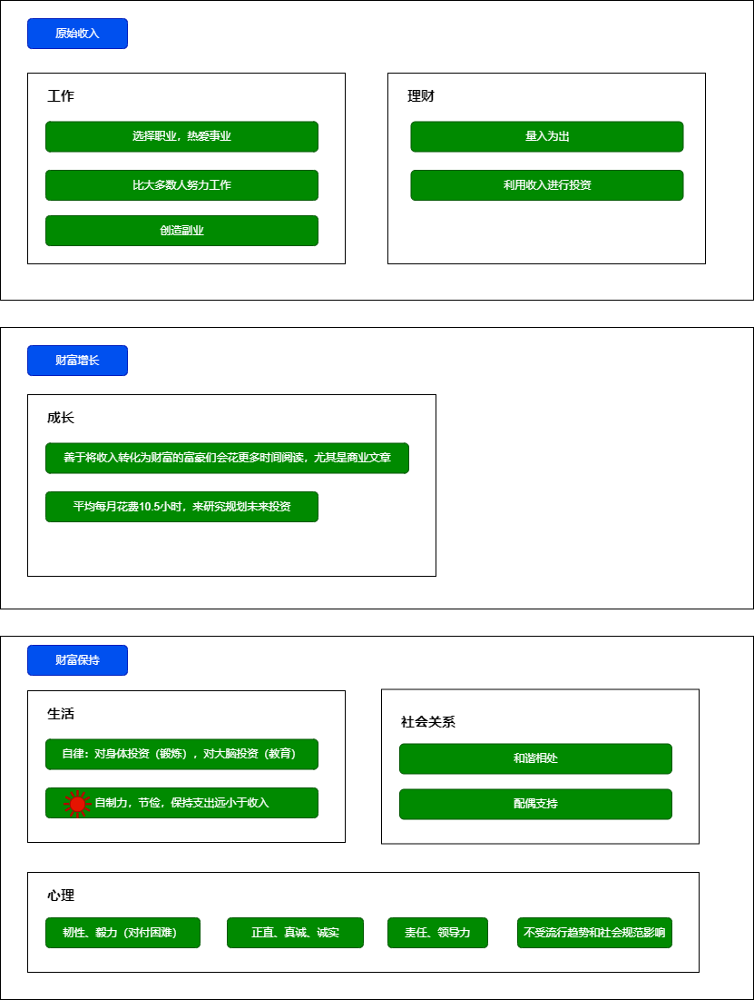

[北大社会学系](http://www.shehui.pku.edu.cn/)

http://sociologyol.ruc.edu.cn/index.

[《世界经济黄皮书：2023年世界经济形势分析与预测》](http://iwep.cssn.cn/xscg/xscg_zzjyz/202212/t20221231_5577037.shtml)

# 经济
[中国经济新动能｜专访林毅夫：如何理解中国当前经济遇到的挑战](https://www.nse.pku.edu.cn/sylm/xwsd/533985.htm)  
经济学都是盛行一时的理论，但要记得它只是盛行一时。实际上理论是帮助我们认识世界、改造世界的工具，让我们看到当前世界的问题在哪里，把背后的道理讲清楚，用来指导我们的实践。  

经济发展的本质要提高生产力，要提高收入水平，实际上是一个结构不断变迁的过程，从低生产力水平的结构变成高生产力水平的结构的一个过程。  

如果按照我们比较优势来发展，中国式现代化的目标以及高质量发展的五个维度都能够同时实现。

[洪永淼：中国经济学之路](https://soe.xmu.edu.cn/old/info/1104/13684.htm)  

[荣兆梓 等：谁是主流，西方经济学还是政治经济学？](https://www.kunlunce.com/llyj/fl1/2023-12-31/174333.html)

# 消费

[当代中国的消费主义现象：消费革命抑或过度消费?](http://sociologyol.ruc.edu.cn/shxyj/fzshx/jjshx/d094964d6e2742d68ef06f2fac261045.htm)

[工作、消费主义和新穷人](https://book.douban.com/subject/35593780/)

[大道至“简”：极简主义消费内涵解构与理论阐释](https://journal.psych.ac.cn/xlkxjz/article/2021/1671-3710/1671-3710-29-11-2043.shtml)

# 财富

[金钱心理学](https://book.douban.com/subject/36415996/)

[财富自由，stanley2019](https://book.douban.com/subject/34464026/)  

本书审视身边**百万富翁所拥有的关键行为特征**，并思考当今造就财富的新方式。

生活中的许多挑战都可以采用这种“平地起高楼”的方法去应对，如学习一项新技能、维持好身材、抚育孩子或者白手创业。任何一项宏伟目标的实现——包括财务独立，都需要长时间的自我监督、对自我才能的认知以及资源的有效分配。  

美国百万富翁中位收入25万美元，净资产中值达350万美元。这一数值与美国普通民众相比，收入是他们的5倍，净资产是他们的35倍；美国百万富翁普遍学历都很高（研究生学历占60%以上，大学学历占93%以上）；仅10%得到过馈赠，其余基本靠自己奋斗，一周工作45小时，保证睡眠7.65小时；节俭不开豪车，车龄3年以上；高收人群集中在行政领导、投资经理、医生等一些人士。  

房价绝不超过年收入的3倍：富豪都是理性、自制的消费者。  

**收入不等于财富**：富豪们的入只占自身财富的8.2%。当我们使用“财富”一词时，指的是一个家庭的净资产，即所有资产减去所有负债。我们用一种简单的方式来定义家庭收入：收入（已实现的）应该在个人所得税报税表中有所体现。    

[小狗钱钱, 舍费尔09](https://book.douban.com/subject/3576486/)

[财富自由之路](https://book.douban.com/subject/27094706/)

[巴菲特致股东的信](https://book.douban.com/subject/30164963/)

[穷查理宝典](https://book.douban.com/subject/4208757/)

[投资者的未来](https://book.douban.com/subject/30313572/)

[穷爸爸、富爸爸](https://book.douban.com/subject/1033778/)

