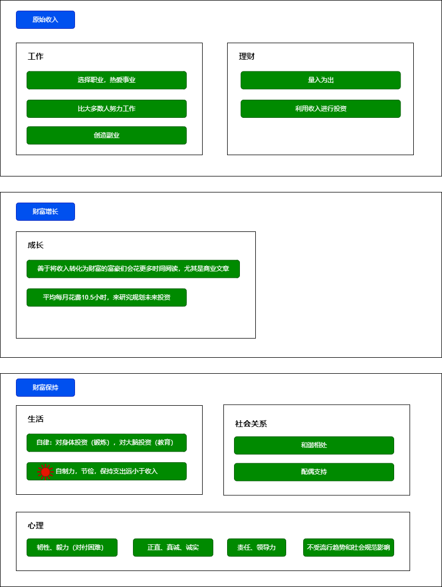
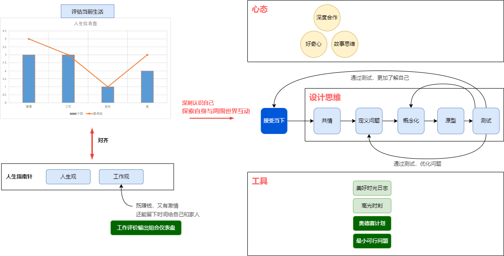
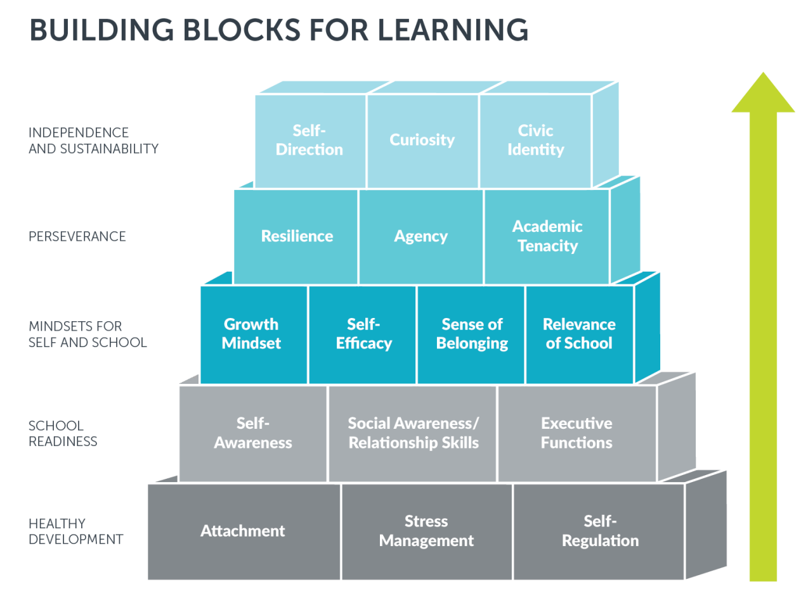
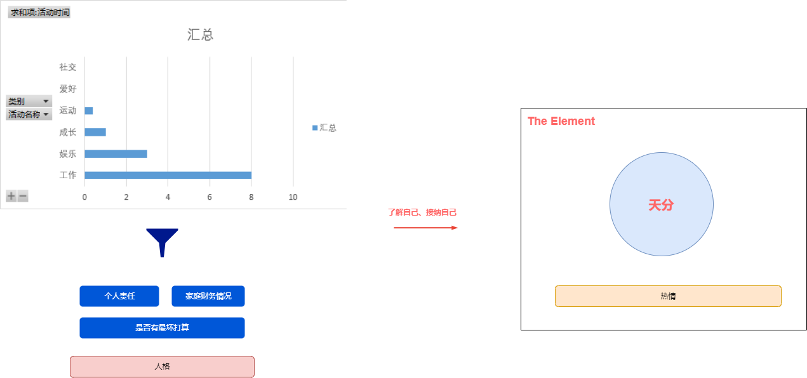

# 财富观念

[金钱心理学](https://book.douban.com/subject/36415996/)

[财富自由，stanley2019](https://book.douban.com/subject/34464026/)  

本书审视身边**百万富翁所拥有的关键行为特征**，并思考当今造就财富的新方式。

生活中的许多挑战都可以采用这种“平地起高楼”的方法去应对，如学习一项新技能、维持好身材、抚育孩子或者白手创业。任何一项宏伟目标的实现——包括财务独立，都需要长时间的自我监督、对自我才能的认知以及资源的有效分配。  

美国百万富翁中位收入25万美元，净资产中值达350万美元。这一数值与美国普通民众相比，收入是他们的5倍，净资产是他们的35倍；美国百万富翁普遍学历都很高（研究生学历占60%以上，大学学历占93%以上）；仅10%得到过馈赠，其余基本靠自己奋斗，一周工作45小时，保证睡眠7.65小时；节俭不开豪车，车龄3年以上；高收人群集中在行政领导、投资经理、医生等一些人士。  

房价绝不超过年收入的3倍：富豪都是理性、自制的消费者。  

**收入不等于财富**：富豪们的入只占自身财富的8.2%。当我们使用“财富”一词时，指的是一个家庭的净资产，即所有资产减去所有负债。我们用一种简单的方式来定义家庭收入：收入（已实现的）应该在个人所得税报税表中有所体现。    

[小狗钱钱, 舍费尔09](https://book.douban.com/subject/3576486/)

[财富自由之路](https://book.douban.com/subject/27094706/)

[巴菲特致股东的信](https://book.douban.com/subject/30164963/)

[穷查理宝典](https://book.douban.com/subject/4208757/)

[投资者的未来](https://book.douban.com/subject/30313572/)

[穷爸爸、富爸爸](https://book.douban.com/subject/1033778/)

# 消费

[当代中国的消费主义现象：消费革命抑或过度消费?](http://sociologyol.ruc.edu.cn/shxyj/fzshx/jjshx/d094964d6e2742d68ef06f2fac261045.htm)

[工作、消费主义和新穷人](https://book.douban.com/subject/35593780/)

[大道至“简”：极简主义消费内涵解构与理论阐释](https://journal.psych.ac.cn/xlkxjz/article/2021/1671-3710/1671-3710-29-11-2043.shtml)

# 自我、性格与职业规划

[填报志愿：远见与想象力](https://www.gotopku.cn/index/detail/505.html)  
我认为专业本质就是一组课程，学生通过大学专业学习形成大脑中的一个知识结构，所以选择专业就是选择未来自己的知识结构。

[斯坦福大学人生设计课](https://book.douban.com/subject/27601926/)   
[设计你的工作和人生](https://book.douban.com/subject/35578313/)

大多数人大部分时间都在工作，因此本书大部分时候都在分析职场。  

有80%的人并不是真的很了解自己的激情所在。如果是为了设计出你热爱的人生，那么你没有必要知道自己对什么充满激情。  

这本书到目前都出了3版了，解决方案还是没有稳定下来，一方面是疫情给全球带来了很大的影响，另一方面也说明生活需要处理的情况太多了。  

[工作：巨变时代的现状、挑战与未来](https://book.douban.com/subject/35686239/)

https://www.mayoclinic.org/

[State of The Global Workplace 2022 Report](https://bluesyemre.com/2022/07/05/state-of-the-global-workplace-2022-report/)

员工幸福感指数，在疫情后不再增长，2017年这个指数是15%。  

[Global Workforce Hopes and Fears Survey 2022](https://www.pwc.com/gx/en/hopes-and-fears/downloads/global-workforce-hopes-and-fears-survey-2022-v2.pdf)

[NACE Job Outlook](https://www.naceweb.org/talent-acquisition/trends-and-predictions/future-forward-key-issues-and-recommendations-for-success-in-2022/)

[UCLA职业规划和探索](https://career.ucla.edu/undergrad/career-planning-and-exploration)

[UCLA职业指南](https://career.ucla.edu/file/ba8f1de4-c80d-4ccb-90c3-ad8c91a604e3)

[美国劳工Occupational Outlook Handbook](https://www.bls.gov/ooh/)

[艾瑞咨询-2022年中国大学生学习与发展白皮书-220415](https://pdf.dfcfw.com/pdf/H3_AP202204151559406158_1.pdf?1650033123000.pdf)

[大学生职业生涯发展与规划]()

[职业的选择]()

[毕业不失业职业生涯步步高]()

职业倦怠

生产资料：销售、报告、计划和预算、项目、产品与服务  
流程：工作流程、程序、晋升和职业发展的路径、沟通  
人力：平易近人、直率真诚真实、可靠、机密、同理心、亲和力、诚信度、情商和自制力  

[Turnaround for Child, brizard2016](https://turnaroundusa.org/what-we-do/tools/building-blocks/)  

[LOUISIANA HIGH SCHOOL PLANNING GUIDEBOOK](https://www.louisianabelieves.com/docs/default-source/course-choice/high-school-planning-guidebook.pdf?sfvrsn=36)

[盖洛普优势识别器 2.0]()

[MBTI](https://www.16personalities.com/ch/%E7%B1%BB%E5%9E%8B%E6%8F%8F%E8%BF%B0)

[在线工具-人格测试](https://www.zxgj.cn/g/dawujianban)

[高敏感是种天赋]()

[The road back to you]()

[专注力就是你的超能力]()

[安静 内向性格的竞争力](https://book.douban.com/subject/11601993/)

[自尊](https://book.douban.com/subject/30408726/)

[活出最乐观的自己](https://book.douban.com/subject/4934590/)

[发现你的天赋]()

本书其实讲的是The element，一种充分发挥自身优势和热情的状态。
核心是通过了解自身人格，SWOT分析后，调整自身的状态。

[九型人格]()

[人性的弱点]()

# 投资

[股市进阶之道：一个散户的自我修养](https://book.douban.com/subject/26427930/)  

[股市真规则](https://book.douban.com/subject/1728725/)  